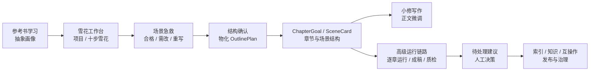
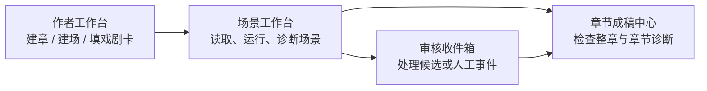
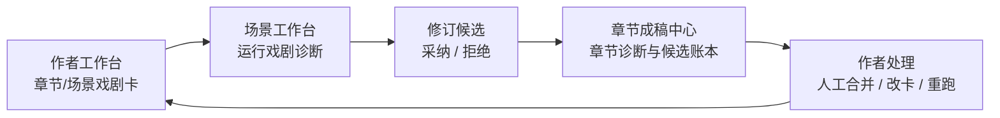
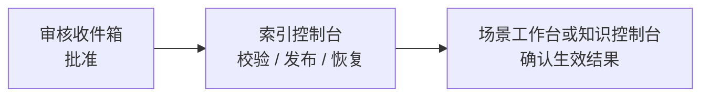

# 雪花法驱动小说系统操作手册

> 面向系统操作者、作者与轻度维护者
> 以当前仓库中的前端页面、Pinia store、FastAPI 路由和本地运行中的 UI 为准
> 本手册是当前唯一维护的操作者入口文档

## 这套系统到底在解决什么问题

这不是一个“只负责写正文”的编辑器，而是一套把小说创作拆成多个可治理环节的共享控制台。当前普通作家主线已经切到 `雪花工作台`：先把小说想法扩成十步雪花，再把场景列表和场景规划物化成章节/场景结构，之后再进入正文小修、审核、参考学习和高级运行链路。

你可以把它理解成一条先规划、再落结构、最后治理运行结果的流水线：

- `雪花工作台` 负责创建项目、十步雪花、场景急救、章节结构草案整理和结构确认。
- `写作总控` 负责接住结构确认后的项目，按下一步启动章节起草、查看进度、审阅正文和批准当前章。
- `小修写作` 负责对已形成的章节或场景正文做小范围人工修订。
- `参考书学习` 负责把参考文本抽成安全的抽象风格画像，再绑定到项目。
- `待处理建议` 负责处理中途异常、QC 阻塞、参考安全风险和其他需要作者决策的建议。
- 高级模式保留作者工作台、场景工作台、章节成稿中心、深改台、长篇控制、文学质检、索引、知识、互操作和系统配置等后台工具。

## 10 分钟上手路径

如果你第一次接触这套系统，先不要试图一次理解全部后台工具。按下面这条雪花主线走就够了：

1. 在仓库根目录运行 `.\start-dev.cmd`，打开 `http://127.0.0.1:5173`。
2. 左侧 `界面模式` 选择 `作家`。作家模式会隐藏大部分内部 ID、hash、payload、JSON/YAML 等技术细节。
3. 默认进入 `雪花工作台`。点击 `项目 / 新建`，填写标题、题材、章节数、目标字数，并粘贴故事起始大纲。
4. 在 `规划` 模式里按顺序处理十步雪花：`生成候选`、人工编辑、`保存步骤`、`确认步骤`。
5. 如果某个角色或长纲步骤暂时不适合当前篇幅，可以点 `跳过` 并写明原因；整理章节结构前，读者定位、一句话概括、一段话概括、场景列表、场景规划仍是硬性检查项。
6. 完成 `场景列表` 和 `场景规划` 后切到 `急救`，点击 `生成急救建议`，把每个场景处理成 `合格 / 需修改 / 废除重写`。
7. 对 `需修改` 或 `废除重写` 的场景，按卡片建议改字段，必要时点 `应用修复`，最后点 `保存急救结果`。
8. 回到 `规划`，在 `整理章节结构` 里点击 `整理成章节结构`，检查章节计划后点击 `确认结构`。
9. 结构确认会创建 `ChapterGoal` 和 `SceneCard`。点击回执里的 `进入写作总控`，按主按钮启动当前章起草、查看后台进度、审阅正文并批准本章。
10. 需要正文微调时进入 `小修写作`；需要参考画像时进入 `参考书学习`；出现需要人工决策的建议时进入 `待处理建议`。更细的场景运行证据、索引发布和互操作回放仍在高级链路中。

第一次上手时，高级模式里的作者工作台、场景工作台、章节成稿中心、深改台、长篇控制、文学质检、索引、知识、互操作和系统配置都可以先只知道用途，不急着精通。

## 作家模式主入口

`作家` 模式是当前真正给写作者日常使用的默认模式。它不会改变数据或生成结果，只改变界面暴露层级：写作者先看到“现在该做什么”和文本判断，高级排查信息默认收起。

作家模式只保留五个主入口：

- `雪花工作台`：创建项目，完成十步雪花，做场景急救，整理并确认章节结构草案。
- `写作总控`：结构确认后的项目主线入口，负责起草当前章、轮询进度、展示终稿审阅正文并批准本章。
- `小修写作`：进入当前章节或场景的正文微调，不承担全书规划。
- `参考书学习`：导入参考书、抽样学习、生成抽象风格画像，并把 `ready` 画像绑定到项目。
- `待处理建议`：处理中途异常、QC 阻塞、参考安全风险和其他需要作者决策的建议。

一条完整的 writer 闭环是：

1. 从 `雪花工作台` 创建项目并确认雪花步骤。
2. 在同页完成场景急救，确保阻塞场景已经修改或明确废除重写。
3. 整理并确认章节结构草案，让系统创建章节和场景的结构化输入。
4. 进入 `写作总控`，按 `next_action` 起草当前章、查看进度、审阅正文并批准本章。
5. 如需正文层小修，进入 `小修写作`；如需抽象风格输入，进入 `参考书学习`；如需人工决策，进入 `待处理建议`。
5. 只有排查运行链路、处理后台发布、查看运行证据或走逐章运行支撑接口时，才切到 `高级` 模式。

## 核心对象词典

下面这些词会在多个页面里反复出现。先理解它们，后面很多页面就不难看了。

| 对象 | 通俗理解 | 主要出现场所 | 你要记住的事 |
| --- | --- | --- | --- |
| `story_project` | 雪花项目 | 雪花工作台 | 它是一本文学项目的根对象，普通作家模式的新书从这里开始。 |
| `snowflake_artifact` | 雪花步骤产物 | 雪花工作台 | 它保存每一层雪花的草稿、确认状态、生成来源和跳过原因。 |
| `outline_plan` | 结构计划 | 雪花工作台 | 它是把已确认的场景列表/场景规划物化成章节结构后的待确认计划。 |
| `chapter_goal` | 章节目标卡 | 作者工作台、章节成稿中心 | 它是章节层 source of truth，负责描述这章要推进什么，不是正文本身。 |
| `scene_card` | 场景卡 | 作者工作台、场景工作台 | 它描述单场景的目标、节拍、人物、地点、必须包含/禁止包含的内容，是运行输入。 |
| `writer_brief_json` | 戏剧卡 | 作者工作台、场景工作台、章节成稿中心 | 它是写作者给系统的戏剧判断输入；章节卡管承诺、推进和余味，场景卡管欲望、阻碍、代价和转折。 |
| `writer_evaluation` | 作家诊断 | 场景工作台、章节成稿中心 | 它按戏剧有效性给出分数、问题列表、证据摘录和修订 brief，是诊断结果，不是正文。 |
| `revision_candidate` | 修订候选 | 场景工作台、章节成稿中心 | 它是可采纳/拒绝的建议稿或修订计划；采纳只记录作者决定，不会自动覆盖终稿。 |
| `review_item` | 审核项 / 待决策候选 | 审核收件箱、知识控制台、参考书学习 | 它表示“系统已经提出一个候选，但还需要人做决策”。 |
| `knowledge_entry` | 长期知识条目 | 知识控制台 | 它是会影响后续生成的长期设定、风格、规则、校准线，而不是正文。 |
| `reference_profile` | 参考画像 | 参考书学习 | 它是从参考书抽出来的抽象风格/结构经验，不应原样复制原文。 |
| `scene_bundle` | 场景运行包 | 场景工作台、互操作中心 | 它是某次场景运行时冻结下来的输入快照，方便追溯“当时到底用什么上下文跑的”。 |
| `final_scene` | 最终场景正文 | 场景工作台、章节成稿中心、互操作中心 | 它是运行后的归档结果，是正文交付物之一。 |
| `scene_memory` | 场景记忆 | 场景工作台、章节成稿中心 | 它是从最终场景提炼出来、供后续场景继续使用的记忆，不等于全文复制。 |
| `chapter_memory` | 章节记忆 / 聚合记忆 | 章节成稿中心 | 它把一章内多个场景的有效结果聚起来，供后续章节或聚合阅读使用。 |

## 左侧菜单总览

这块左侧导航栏就是整套系统的总入口。当前默认第一屏是 `雪花工作台`。`作家` 模式只显示雪花主线和少量辅助入口，减少第一次使用时的技术噪音；`高级` 模式会显示全部后台工具，并额外露出旧页面名、`view` 标识、缓存和分组信息，方便和历史文档、代码对象对照。

左侧还有 `界面模式` 切换：

- `作家`：默认模式，导航和页头都先回答“现在该做什么”，旧页面名、`view`、hash、payload、JSON/YAML 等内容默认收起，适合从雪花规划推进到结构确认。旧环境里存过的 `guided` 会自动迁移成 `writer`。
- `高级`：导航和页头会露出旧页面名、`view`、`cache`、`group` 等技术字段，并自动展开证据区、内部 ID、YAML/JSON、别名、hash、payload 等排查信息。

新版页面内部也遵循同一规则：系统配置里的 YAML/历史、知识候选的附加载荷 JSON、互操作的 hash/envelope、场景运行的 bundle/hash，以及审核/索引里的 `review_id`、`target_ref`、`job_id`，都会在 `作家` 模式下弱化或收起，在 `高级` 模式下完整展示。

### 作家模式入口

| 入口 | 它的角色 | 什么时候打开 | 常见下一站 |
| --- | --- | --- | --- |
| `雪花工作台` | 新书主入口 | 创建项目、确认十步雪花、做场景急救、整理并确认章节结构时 | 小修写作、参考书学习、待处理建议 |
| `写作总控` | 章节主线入口 | 雪花结构确认后，需要起草当前章、查看进度、审阅正文或批准本章时 | 小修写作、待处理建议、章节成稿中心 |
| `小修写作` | 正文微调入口 | 已有章节或场景正文，需要小范围人工修订时 | 雪花工作台、写作深改、章节成稿中心 |
| `参考书学习` | 抽象画像入口 | 要导入参考书、抽样学习、生成画像并绑定项目时 | 雪花工作台、审核收件箱 |
| `审核收件箱` | 人工决策入口 | 系统给出候选、QC 阻塞、参考安全风险或人工事件时 | 雪花工作台、索引控制台、知识控制台 |

### 高级模式工具

高级模式会显示全部页面。它们仍然可用，但不是普通作家第一次上手的默认路径。

| 步骤按钮 | 旧页面名 | 它的角色 | 什么时候打开 | 常见下一站 |
| --- | --- | --- | --- | --- |
| `1 配置环境` | 系统配置 | 环境与模型治理 | 首次接入、切换 API、配置模型、保存快照、验证发布时 | 场景工作台、参考书学习 |
| `2 编排章节` | 作者工作台 | 章节/场景的后台编排入口 | 需要直接维护 `ChapterGoal` / `SceneCard` 或排查旧链路时 | 场景工作台 |
| `3 运行场景` | 场景工作台 | 单场景运行主控台 | 要跑一个场景、读运行证据、看 QC 时 | 审核收件箱、章节成稿中心 |
| `4 处理审核` | 审核收件箱 | 人做决策的入口 | 系统给出候选，需要批准/发布/处理人工事件时 | 索引控制台、知识控制台 |
| `5 文学质检` | 文学质量引擎 | 文学质量巡检 | 要检查作者稿优先的章节/场景文本风险时 | 写作深改、审核收件箱 |
| `5 查看成稿` | 章节成稿中心 | 章节正文与聚合结果查看页 | 要检查一整章最终可读文本时 | 作者回收站、场景工作台 |
| `6 写作深改` | 写作与深改台 | 深改诊断和局部候选 | 要从作者稿反向提取戏剧卡、跑深改诊断或生成候选时 | 小修写作、章节成稿中心 |
| `6 长篇控制` | 长篇控制塔 | 汇总长篇压力点 | 要看章节节奏、人物弧线、悬念债务和连续性风险时 | 章节成稿中心、知识控制台 |
| `7 回收内容` | 作者回收站 | 作者层回收/恢复/永久清除 | 误删、停用、清理章节或场景时 | 作者工作台 |
| `8 发布索引` | 索引控制台 | 发布、校验、恢复后台 | 想看候选有没有真正发布、校验有没有通过、恢复有没有介入时 | 场景工作台、审核收件箱 |
| `9 沉淀知识` | 知识控制台 | 长期知识库 | 要创建长期规则、查看当前生效知识、追踪知识版本时 | 审核收件箱、索引控制台 |
| `10 学习参考` | 参考书学习 | 从参考书提炼抽象经验 | 要导入参考书、抽样学习、生成画像、手动应用时 | 审核收件箱、知识控制台 |
| `11 导入导出` | 互操作中心 | 工作表预览/导入/导出/回放 | 要做 YAML worksheet、导入外部包、导出 bundle、回放 final/draft 时 | 场景工作台 |

## 页面逐页说明

下面重点说明当前雪花主线和高级模式中仍会用到的页面：做什么、为什么需要、什么时候进、页面区块、典型操作、上下游、最容易误解的点。旧页面说明保留为高级工具说明；普通作家日常优先从 `雪花工作台` 开始。

---

## 雪花工作台

### 这个模块做什么

- 创建和切换雪花项目。
- 按十步雪花生成候选、编辑草稿、保存步骤、确认步骤。
- 记录跳过原因，让不适合当前篇幅的步骤以可追踪方式继续往下走。
- 在 `规划` 和 `急救` 两种模式之间切换，先完成结构草案，再筛掉薄弱场景。
- 把已确认的场景列表和场景规划物化为结构计划，并最终确认成 `ChapterGoal` 和 `SceneCard`。

### 为什么系统需要它

旧链路要求作者先理解章节卡、场景卡、运行包、审核项和成稿中心。雪花工作台把这些后台对象前置成一条更像写作思考的路径：先知道写给谁、故事一句话是什么、角色和场景如何升级，再把这些规划落到系统可运行的章节和场景结构里。

### 什么时候应该进入这个页面

- 你要开一本新书或切换已有雪花项目。
- 你只有故事起点、大纲或人物关系，需要系统协助扩成结构化规划。
- 你要检查每一层雪花是否已经确认。
- 你要用场景急救筛查场景是否薄、散、缺转折或缺代价。
- 你要把雪花规划物化成后续运行链路能使用的章节/场景结构。

### 页面里的主要区块和关键按钮

- `项目 / 新建`
  打开项目抽屉，左侧可切换已有项目，表单可新建项目。新建至少需要 `故事起始大纲`，标题、题材、章节数、目标字数可选但建议填写。
- `规划`
  十步雪花编辑区。常见按钮是 `生成候选`、`跳过`、`保存步骤`、`确认步骤`。有修改未保存时，确认按钮会先保存再确认。
- `常驻助手`
  可以分析当前步骤、强化当前稿，或针对当前场景急救项给出修法。点 `应用候选` 只会把助手建议合并进草稿，仍需保存和确认。
- `场景板`
  在场景列表/场景规划出现后，把章节、场景摘要、坩埚、目标、挫折、困境、钩子等字段合并展示；这里的字段变更会直接保存到场景计划。
- `急救`
  对场景生成急救建议，并按 `全部 / 重写 / 需改 / 合格 / 人工标记` 筛选。场景卡片里可以手动改状态、补原因、补修复步骤，或点 `应用修复` 把修复写回场景计划。
- `整理章节结构`
  准备度检查会显示 `可以整理`、`可整理，有预警` 或 `还差几项`。按钮包括 `整理成章节结构` 和 `确认结构`。

### 一次典型操作怎么走

1. 打开 `雪花工作台`，点 `项目 / 新建`。
2. 填标题、题材、目标章节数/字数，并粘贴故事起始大纲。
3. 在 `规划` 里从 `读者定位` 开始，逐步 `生成候选`、编辑、`保存步骤`、`确认步骤`。
4. 处理到 `场景列表` 和 `场景规划` 时，检查场景 ID、章节归属、主动/反应类型、摘要、坩埚、目标/冲突/挫折或反应/困境/决定。
5. 切到 `急救`，点 `生成急救建议`。
6. 对阻塞或低分场景补字段、改类型、改钩子，必要时点 `应用修复`。
7. 点 `保存急救结果`。
8. 回到 `规划`，在 `整理章节结构` 点 `整理成章节结构`。
9. 检查生成的章节卡片，确认没有阻塞项后点 `确认结构`。
10. 结构确认后，系统已把规划落成后续链路使用的 `ChapterGoal` 和 `SceneCard`；正文微调去 `小修写作`，人工决策去 `待处理建议`。

### 上游来自哪里、下游去哪里

- 上游：作者输入的大纲、项目标题/题材/目标篇幅，以及可选的 `参考书学习` ready 画像。
- 下游：确认结构后进入章节/场景结构；需要正文微调去 `小修写作`，需要人工决策去 `待处理建议`，需要逐章运行或运行证据时切到高级链路。

### 最容易误解的点

- `生成候选` 不是自动定稿。每一层都需要作者读过、编辑过，并点 `确认步骤`。
- `跳过` 不是无痕跳过。系统会记录原因；整理章节结构前的硬性检查步骤不能用跳过绕开。
- `急救` 不是正文润色器。它检查场景结构是否成立，重点是目标、阻力、代价、选择和钩子。
- `应用修复` 只把急救建议写回场景计划，不代表已经生成正文。
- `整理成章节结构` 生成的是待确认结构计划；点 `确认结构` 后，才真正创建后续链路使用的章节和场景结构。
- 当前雪花工作台不直接承担 `运行本章` 或 `批准终稿`；结构确认后通过 `写作总控` 进入这条主线。LLM 未启用时，写作总控会阻止真实章节起草，避免离线占位内容被误认为正文。

---

## 作者工作台

### 这个模块做什么

- 编排活跃章节。
- 为每个章节维护章节目标卡。
- 为每个章节维护面向写作者的章节戏剧卡。
- 为每个章节维护场景列表和场景卡。
- 为每个场景维护面向写作者的场景戏剧卡。
- 把具体场景交给 `场景工作台` 去运行。

### 为什么系统需要它

因为运行时需要清晰、结构化的输入。如果没有章节目标卡和场景卡，后续生成就只能直接吃自然语言散稿，既难复用，也难审核，更难追责。

### 什么时候应该进入这个页面

- 你要新建章节或场景。
- 你要修改某章的目标、主线推进、情绪目标、禁止包含项。
- 你要补充 writer brief / 戏剧卡，让系统知道这一章或这一场的戏剧承诺。
- 你要调整场景顺序、标记章节末场。
- 你已经选好了一个场景，准备送去运行。

### 页面里的主要区块和关键按钮

- `章节列表`
  选择当前要编辑的章节，也能批量把章节移入回收站。
- `章节表单`
  维护章节级输入，关键字段包括章节 ID、计划场景数、章节目标，以及中段汇总开关。下面的 `戏剧卡` 是章节级 writer brief，用来写 `核心承诺`、`主线推进`、`人物变化`、`章节问题`、`结尾余味`。
- `场景列表`
  维护当前章节下的场景顺序和状态；常见按钮是 `上移`、`下移`、`标记为章节结尾`、`在场景工作台打开`。
- `场景表单`
  维护单场景输入，重点是 `场景目标`、`节拍`、`人物`、`地点`、`必须包含`、`禁用文本`。下面的 `戏剧卡` 是场景级 writer brief，用来写 `人物欲望`、`阻碍`、`风险/代价`、`秘密/误解`、`潜台词`、`不可逆变化`、`读者问题`。
- 顶部动作按钮
  `刷新工作台`、`新建章节`、`快速新建场景`、`新建场景`。

### 一次典型操作怎么走

1. 先在左侧章节列表选择一个章节。
2. 在中间 `章节表单` 里把章节目标、主线推进、情绪目标补完整，再填章节 `戏剧卡`。
3. 在右侧 `场景列表` 里选择某个场景，或新建一个场景。
4. 在下方 `场景表单` 里补齐目标、节拍、视角人物、地点与限制项，再填场景 `戏剧卡`。
5. 点击 `保存场景`。
6. 如果要开始运行，直接点该场景的 `在场景工作台打开`。

### 上游来自哪里、下游去哪里

- 上游：通常没有固定上游，它是作者层起点。
- 下游：最常见是去 `场景工作台`；如果章节或场景不再使用，则去 `作者回收站`。

### 最容易误解的点

- 这里不是正文编辑器。这里写的是“运行输入”，不是最终成稿。
- `戏剧卡` 也不是正文草稿。它是系统后续生成和作家诊断会参考的判断框架，帮助你先说清“这一章/这一场为什么值得读”。
- 这里的 `运行章节` 更偏批处理入口，不代表你可以跳过场景工作台理解单场景状态。
- 章节和场景卡是作者层权威输入，不应该用运行态的 QC 或失败状态去回写替代它们的创作意图。

---

## 章节成稿中心

### 这个模块做什么

- 查看一整章当前可读的正文结果。
- 对比 `实时拼接正文` 和 `最终聚合正文`。
- 运行章节级作家诊断，集中查看章级问题、场景诊断和候选修订。
- 维护章节下场景的顺序、末场标记和回收动作。

### 为什么系统需要它

单场景运行完成，不等于一整章就可读了。系统需要一个“章级阅读页”把当前所有场景结果拼起来，再把章节记忆聚合结果展示出来，帮助你判断这一章能否交付。

### 什么时候应该进入这个页面

- 跑完一章里的若干场景后，想检查整章是否顺畅。
- 想看 `assembled` 与 `aggregate` 的差异。
- 想重新跑整章或执行最终聚合。
- 想判断“这一章读起来是否成立”，并处理章级候选修订。
- 想从章级视角管理当前场景顺序。

### 页面里的主要区块和关键按钮

- `章节`
  选择当前要查看的章节。
- `章节与场景管理`
  看当前章节的聚合同步状态、源书安全扫描和基础信息。
- `成稿对照`
  左右对照 `实时拼接正文` 与 `最终聚合正文`。
- `成稿编辑台`
  集中处理 writer 模式的章级判断：`运行章节诊断`、查看章节问题列表、查看每个场景的证据摘录和修订方向，以及处理 `候选账本`。
- 常见按钮
  `刷新`、`新建章节`、`新建场景`、`回收站`、`保存章节`、`运行整章`、`运行最终聚合`、`运行章节诊断`、`采纳`、`拒绝`、`复制`、`下载`。

### 一次典型操作怎么走

1. 选一个章节。
2. 先看中间区域是否显示 `聚合已同步` 或仍有缺口。
3. 在右侧阅读 `实时拼接正文` 与 `最终聚合正文`。
4. 如果场景级内容都完成但章级聚合没更新，执行 `运行最终聚合`。
5. 在 `成稿编辑台` 点击 `运行章节诊断`，看节奏断点、场景缺口、场景诊断和候选账本。
6. 对候选修订选择 `采纳` 或 `拒绝`。采纳只是记录作者决定，不会覆盖章节正文。
7. 确认章节文本可读后，再决定是否导出、复制、人工合并候选，或继续修改作者层输入。

### 上游来自哪里、下游去哪里

- 上游：来自 `作者工作台` 的章节/场景输入，以及 `场景工作台` 的场景运行结果。
- 下游：通常回到 `作者工作台` 修卡，打开 `场景工作台` 看单场证据，或打开 `作者回收站` 处理无效内容。

### 最容易误解的点

- `实时拼接正文` 不是最终章级记忆，它只是把当前场景结果按顺序拼起来。
- `最终聚合正文` 依赖章节记忆与聚合步骤，不一定和实时拼接结果完全相同。
- 这一页用于“读整章”，不是替代场景工作台看单场景证据。
- `候选账本` 里的 `采纳` 不会改写 `实时拼接正文` 或 `最终聚合正文`。它只把候选状态改成已采纳，方便作者后续人工合并或回到生成链路重跑。

---

## 作者回收站

### 这个模块做什么

- 管理已经从作者层移出的章节和场景。
- 支持恢复。
- 支持永久清除。

### 为什么系统需要它

作者层需要一个缓冲区，避免误删章节/场景后直接影响当前创作流。同时，运行链里很多对象已经形成下游引用，系统必须在清除前做谨慎校验。

### 什么时候应该进入这个页面

- 你把章节或场景移入回收站后，想恢复它。
- 你确定某些作者层记录不再使用，准备永久清理。
- 你想排查“为什么这里删不掉”。

### 页面里的主要区块和关键按钮

- `章节回收区`
  批量恢复或永久清除章节。
- `场景回收区`
  批量恢复或永久清除场景。
- 关键按钮
  `刷新回收站`、`恢复所选章节`、`永久清除所选章节`、`恢复所选场景`、`永久清除所选场景`。

### 一次典型操作怎么走

1. 打开回收站，先分清你要处理的是章节还是场景。
2. 勾选目标项。
3. 如果只是误移除，选 `恢复`。
4. 只有在确认下游不再需要时，才使用 `永久清除`。

### 上游来自哪里、下游去哪里

- 上游：来自 `作者工作台` 和 `章节成稿中心` 的回收动作。
- 下游：恢复后通常回到 `作者工作台` 继续编辑。

### 最容易误解的点

- `移入回收站` 不等于真的从系统里彻底消失。
- `永久清除` 不只是 UI 删除，它还要考虑是否已有运行结果、审核链、记忆链等下游引用。

---

## 场景工作台

### 这个模块做什么

- 运行单个场景。
- 在运行前检查输入、依赖和约束。
- 运行单场作家诊断，判断这一场是否成立。
- 查看场景的生成证据、QC 报告、源书安全扫描、尝试时间线和人工回流。

### 为什么系统需要它

作者工作台负责“把卡片写清楚”，场景工作台负责“真的跑起来并留下证据”。两者不能混在一起，否则作者层会被运行细节污染，运行层也失去可追踪性。

### 什么时候应该进入这个页面

- 你已经选定一个具体场景，准备运行。
- 你要看某个场景为什么没跑起来。
- 你要诊断某一场的欲望、阻碍、代价、转折、潜台词和读者钩子是否成立。
- 你要看某次生成用的 bundle、QC、Prompt Hash、Token、Latency、Final Scene。
- 系统提示有人工作业，需要你判断是重试、放行还是转人工。

### 页面里的主要区块和关键按钮

- 顶部输入区
  `场景 ID` 输入框、`读取`、`启动场景运行`。
- 状态条
  一眼告诉你当前场景、预检状态、终稿行、QC、Archive Quality、运行轨迹和运行任务状态。
- `运行前检查`
  这是起跑前检查，不是运行结果。它会告诉你能不能跑、缺什么、有什么警告、有哪些上下文冲突。
- `这一场是否成立`
  这是 writer 模式最关键的作家诊断卡。点击 `运行戏剧诊断` 后，它会显示总分、维度分、问题列表、证据摘录、可执行修订 brief 和 `修订候选`。
- `生成证据`
  展示最近一次生成用了什么模型、哪一步、多少 token、耗时多久、Prompt Hash 是什么。
- `QC 报告`
  展示 Hard QC / Soft QC 的结论、Resolution、Issue Keys、Next Action。
- `源书安全扫描`
  告诉你当前场景有没有命中保护标记，帮助你判断是否存在参考书泄露风险。
- `包谱系`
  用来追踪这个场景当前用的是哪个 bundle，它如何串到 draft、final、memory。
- `执行轨迹`
  看这一场景历史上尝试过什么步骤，而不是只看最后一次是否成功。
- `人工回流`
  当系统自己不能安全决定时，会在这里把问题抛回给人。

### 一次典型操作怎么走

1. 从 `作者工作台` 打开某个场景，或在这里直接输入场景 ID 后点 `读取`。
2. 先看 `运行前检查`。
   如果显示可以运行，说明最低条件到位；如果有阻塞项，先补依赖或处理冲突。
3. 点击 `启动场景运行`。
4. 运行完成后先看状态条，再看 `生成证据` 和 `QC 报告`。
5. 点击 `运行戏剧诊断`，阅读 `问题列表`、`可执行修订 brief` 和 `修订候选`。
6. 如果候选方向有价值，点 `采纳`；如果不适合，点 `拒绝`。采纳不会覆盖当前 `定稿`，只是把候选状态记录下来。
7. 如果系统产生人工事件，转到 `人工回流` 或 `审核收件箱` 继续处理。
8. 如果场景已归档，去 `章节成稿中心` 看它进入整章后的效果；如果采纳了候选，下一步通常是人工合并句段、改戏剧卡后重跑，或继续做章级诊断。

### 上游来自哪里、下游去哪里

- 上游：主要来自 `作者工作台` 的场景卡，也会消费当前已生效知识、参考画像和系统配置。
- 下游：常见去向是 `审核收件箱`、`章节成稿中心`，必要时也会去 `索引控制台` 看发布与恢复。

### 最容易误解的点

- `运行前检查` 不是“挑刺区”，而是发车前的安全检查。它说不能跑时，通常不是 UI 问题，而是上下文还不够或有约束冲突。
- 作家诊断不是 QC。QC 更像最低质量门禁，作家诊断更像编辑判断：它会指出戏剧弱点和修订方向。
- `修订候选` 不是自动改稿按钮。`采纳` 只记录作者决定，终稿仍需要作者人工合并或重新进入生成流程。
- `执行轨迹` 不是最终正文历史，而是“这个场景经历了哪些步骤、失败过什么、重试了什么”。
- `人工回流` 不是报错垃圾桶，而是系统明确承认“这里需要人判断”。
- `包谱系` 的价值在追溯。你以后想解释“为什么跑出这个结果”，往往要回到这里。

---

## 审核收件箱

### 这个模块做什么

- 处理普通审核项。
- 处理人工审核事件。
- 把“候选”变成“已批准 / 已发布 / 已生效”的闭环入口。

### 为什么系统需要它

系统会不断产生候选：知识候选、参考学习候选、回流候选、恢复事件。它们不能直接默认进入运行时，因为这会让错误、脏数据和未验证内容直接污染后续生成。

### 什么时候应该进入这个页面

- 场景工作台或参考学习提示有待处理项。
- 知识控制台创建了新候选。
- 你要明确某个候选有没有真正落地。
- 系统产生了人工事件，需要你做重试、检查或发布动作。

### 页面里的主要区块和关键按钮

- `筛选`
  普通审核项和人工事件分开筛选，避免互相干扰。
- `人工事件`
  处理由恢复、运行异常、人工场景审核等来源产生的事件。
- `审核项`
  常规候选处理主区，常见动作是 `批准` 和 `发布/已生效`。
- `作家 / 高级`
  作家模式优先显示“审核线索”“关联目标”等人能直接理解的描述；高级模式会显示 `review_id`、`target_ref`、校验任务 ID 和完整载荷，适合排查闭环。

### 一次典型操作怎么走

1. 先看有没有 `人工事件`，因为这通常代表系统卡住了。
2. 再看 `审核项` 列表，打开与你当前工作流相关的候选。
3. 先理解来源、影响范围和运行时状态。
4. 需要落地时点 `批准`。
5. 如果页面提示还需要发布，再执行发布；如果显示 `已生效`，说明当前候选已经是运行时版本，无需重复发布。

### 上游来自哪里、下游去哪里

- 上游：`场景工作台`、`参考书学习`、`知识控制台`、系统恢复流程。
- 下游：常见是 `索引控制台`、`知识控制台`，也可能跳回 `场景工作台` 看关联目标。

### 最容易误解的点

- `批准` 不总是等于“马上进运行时”。它先表示“业务上同意这条候选”。之后是否还要 `校验`、`发布`，取决于对象类型和当前状态。
- `发布` 的意义是把已经批准且可用的版本切到运行时生效位。如果页面已经告诉你 `已生效`，不要重复理解成漏步骤。
- 普通审核项和人工事件不是一回事：前者更像候选决策，后者更像异常或卡点处理。

---

## 索引控制台

### 这个模块做什么

- 看候选是否真正完成校验与发布。
- 看别名、校验任务、恢复时间线、系统活动和人工操作活动。
- 手动触发 `运行到期发布` 和 `恢复扫描`。

### 为什么系统需要它

因为“人批准了”不等于“技术上已经可以安全提供给运行时”。有些对象还需要做索引重建、版本校验、别名切换或恢复处理，索引控制台就是这部分后台治理页。

### 什么时候应该进入这个页面

- 审核已经做完，但你怀疑候选没有真正进入运行时。
- 知识条目或参考画像卡在待校验、待发布。
- 系统出了恢复事件，你要看它有没有自动修复。
- 你需要看活动轨迹和目标活动组，确认到底哪一步卡住。

### 页面里的主要区块和关键按钮

- 顶部状态区
  展示待发布数、失败校验数、恢复事件数。
- 过滤区
  过滤别名状态、任务、目标引用、来源、工作器、是否只看卡住任务。
- `运行到期发布`
  让已满足条件的对象切到运行时。
- `恢复扫描`
  扫描卡住或异常的后台对象，必要时生成恢复事件。
- 任务区
  处理重建索引与校验任务，常见动作是 `重试校验`。
- 活动区
  包括恢复时间线、系统活动、人工操作和目标活动组。

### 一次典型操作怎么走

1. 从审核收件箱来到这里时，先看顶部有没有 `待发布` 或 `失败校验`。
2. 如果对象应该生效但没生效，作家模式先按审核线索、目标线索或别名理解；需要精确排查时切到高级模式，再按 `审核 ID`、`target_ref` 或 `job_id` 筛选。
3. 看任务状态是否卡住、失败或等待重试。
4. 需要时点 `重试校验`、`运行到期发布`。
5. 如果怀疑有脏状态，再跑 `恢复扫描` 并查看恢复时间线。

### 上游来自哪里、下游去哪里

- 上游：`审核收件箱`、`知识控制台`、后台发布流程。
- 下游：经常回 `审核收件箱`、`场景工作台`、`知识控制台` 做交叉确认。

### 最容易误解的点

- 这不是常规作者页，而是后台治理页。平时没有卡点时，你不需要一直盯着它。
- 为什么需要 `审核 / 校验 / 发布` 三段？
  因为系统把“业务决策正确”“技术验证通过”“运行时正式切换”分开，才能保留回滚、追溯和恢复空间。
- 如果这里显示没问题，但结果仍不对，往往要回 `场景工作台` 看 bundle、QC 或源书安全扫描，而不是继续在索引页硬找。

---

## 知识控制台

### 这个模块做什么

- 新建长期知识候选。
- 查看当前生效知识和候选知识。
- 追踪知识条目的版本、关联审核、关联任务、人工事件和目标活动。

### 为什么系统需要它

小说系统不能每次都只靠单场景临时上下文。角色声线、关系、世界规则、风格规则、校准线、摘要等，需要被沉淀成长期资产，后续运行才能复用。

### 什么时候应该进入这个页面

- 你想手工创建一条长期规则或风格候选。
- 你想确认某条知识当前是 `active`、`candidate` 还是 `resolved`。
- 你想追踪一条知识从创建到审核、校验、发布的整个过程。
- 你想查看由参考书学习生成的候选是否已真正生效。

### 页面里的主要区块和关键按钮

- 顶部过滤区
  按对象类型、作用域、作用域引用、状态过滤。
- `新建候选`
  手工创建长期知识候选；这里会要求你填 `审核 ID`、`条目类型`、`lineage key`、作用域、候选文本等。
- `批准后生效`
  这是一个很重要的开关：`是` 表示批准后直接作为当前运行时版本；`否` 表示还要完成校验，再发布到运行时。
- `目录`
  把生效条目和暂存候选合并展示，方便你从血缘键角度理解一条知识当前处于什么状态。
- 详情抽屉
  展示 `版本历史`、`关联审核`、`关联任务`、`关联人工审核`、`目标活动`、`审核引用`、`包引用`。

### 一次典型操作怎么走

1. 在左侧 `新建候选` 填写候选。
2. 决定 `批准后生效` 是 `是` 还是 `否`。
3. 提交候选。
4. 到右侧目录找到这条知识，进入详情。
5. 根据详情中的 `关联审核` 和 `关联任务`，去 `审核收件箱` 或 `索引控制台` 继续走闭环。

### 上游来自哪里、下游去哪里

- 上游：人工手动创建、`参考书学习` 自动提炼、某些运行归档结果。
- 下游：`审核收件箱`、`索引控制台`、最终会回到 `场景工作台` 影响后续生成。

### 最容易误解的点

- 这里不是写正文的页面。这里维护的是“长期影响正文的知识”。
- 为什么不是“创建后立刻生效”？
  因为长期知识一旦进运行时，会反复影响后续场景。系统把 `创建候选 -> 批准 -> 必要时校验 -> 发布/生效` 拆开，是为了避免把错误规则直接扩散。
- `批准后生效 = 是` 不代表你可以永远跳过审核链；它只是告诉系统该对象批准后可以直接成为当前版本。

---

## 参考书学习

### 这个模块做什么

- 导入参考书。
- 让系统按轮次抽样和分析参考内容。
- 生成待审核候选与参考画像。
- 将画像应用到全局、章节或场景。

### 为什么系统需要它

如果你想让系统学习“写法、结构、节奏、校准线”，不能直接把整本参考书生吞进提示词。参考书学习负责把源书拆分、抽样、提炼成抽象经验，再通过审核链转为系统可用知识。

### 什么时候应该进入这个页面

- 你要导入一本文本参考书。
- 你要推进抽样分析轮次。
- 你要审核参考候选。
- 你要生成画像并手动应用到某个范围。

### 页面里的主要区块和关键按钮

- `导入参考书`
  支持本机路径或上传文本文件，并要求你明确云端处理策略。
- `学习任务`
  当前选中参考书后，在这里推进抽样分析、审核候选、生成画像、手动应用。
- `学习树`
  显示当前参考书的覆盖树和学习进度。
- `审核卡`
  展示由参考学习提炼出的待审核候选。
- `画像`
  展示由批准结果综合出的参考画像，并提供应用动作。
- 关键动作
  `导入书籍`、`抽样分析/继续分析`、`审核候选`、`生成画像`、`手动应用`、`去审核收件箱`、`去知识控制台`。

### 一次典型操作怎么走

1. 先导入一本参考书。
2. 选中该书后，开始抽样分析。
3. 系统每推进一轮，就会沉淀一批候选卡。
4. 审核这些候选。
5. 当覆盖足够时，生成画像。
6. 把画像应用到 `global`、`chapter` 或 `scene`。
7. 应用动作会继续生成审核项，之后转到 `审核收件箱` 完成批准/发布。

### 上游来自哪里、下游去哪里

- 上游：外部参考书文本。
- 下游：`审核收件箱`、`知识控制台`，最终影响 `场景工作台` 的运行上下文。

### 最容易误解的点

- 参考书学习不是“直接让系统照着写”。它学的是抽象风格、结构和规则，不是原文照搬。
- 为什么不是“学完马上生效”？
  因为从源书抽出的结果必须先经过人工审核，必要时再进入知识与发布链，才能保证不把错误或侵权风险直接带入运行时。
- `应用画像` 也不是最终一步。应用通常会生成新的审核项，真正进入运行时还要经过后续审核/发布。

---

## 互操作中心

### 这个模块做什么

- 预览严格格式的 `worksheet_yaml`。
- 导入外部工作表。
- 导出现有 bundle worksheet。
- 回放 final scene 或 draft，把结果重新装回查看面板。

### 为什么系统需要它

系统需要一个对外交换和复盘接口，方便做外部工具集成、严格导入校验、证据回放和版本对照。否则很多跨系统工作只能靠手工复制粘贴。

### 什么时候应该进入这个页面

- 你手上有一份 YAML 工作表，想先校验再导入。
- 你想把当前 bundle 导出给外部流程。
- 你想回放一条 final scene 或 draft，核对其信封与来源比较。

### 页面里的主要区块和关键按钮

- `预览工作表`
  粘贴 YAML，先做后端校验。
- `包导出与回放`
  按 bundle ID、final scene row ID、draft row ID 做装载或回放。
- `结果信封`
  展示归一化后的 envelope 和 `source_ref_comparisons`。
- 关键按钮
  `预览工作表`、`导入工作表`、`加载导出结果`、`回放终稿场景`、`回放草稿`。

### 一次典型操作怎么走

1. 先把 YAML 粘进左侧。
2. 点击 `预览工作表`，先看是否通过严格校验。
3. 没问题再 `导入工作表`。
4. 如果你要复盘现有结果，就在中间输入 bundle ID / final scene row ID / draft row ID 做加载或回放。

### 上游来自哪里、下游去哪里

- 上游：外部 YAML、已有 bundle/final/draft。
- 下游：常回到 `场景工作台` 查看对应场景。

### 最容易误解的点

- 这里是“交换与回放台”，不是日常作者页。
- `预览` 和 `导入` 必须分开理解：预览是校验，导入才是真正落地。

---

## 系统配置

### 这个模块做什么

- 配置 API 地址、操作员标识、管理令牌。
- 接入本地或云端模型。
- 配置节点路由矩阵。
- 做连接测试、验证发布、评测、风格画像调试、YAML 导出和快照管理。

### 为什么系统需要它

因为整条系统链路都依赖“连到谁、用哪个模型、哪个节点跑哪类任务、当前激活快照是什么”。如果没有统一配置页，作者层和运行层都会变成黑盒。

### 什么时候应该进入这个页面

- 首次启动系统。
- 更换后端地址。
- 增删模型提供方。
- 调整节点路由。
- 跑验证发布或文学评测。
- 查看或激活某个配置快照。

### 页面里的主要区块和关键按钮

- `连接设置`
  配 API 地址、操作员标识、管理令牌，并可测试连接。
- `模型接入`
  接入本地 Ollama、本地 LM Studio、自定义本地服务、中转站/CLIProxyAPI、云厂商 API Key 等。
- `节点路由`
  决定每个 LLM 节点真正用哪个提供方、模型和结构化输出设置。
- `验证发布`
  汇总账号、节点、探测结果和激活快照。
- `文学评测`
  小规模跑评测，看看模型质量是否符合预期。
- `风格画像契约`
  调试结构化风格画像的抽取和提交。
- `配置类别 / 版本历史 / 导出 YAML`
  用于草稿、激活、历史和导出管理。

### 一次典型操作怎么走

1. 新环境先配 `连接设置`。
2. 再到 `模型接入` 添加可用提供方。
3. 到 `节点路由矩阵` 给各类任务绑定模型。
4. 用 `验证发布` 和 `测试连接` 检查可用性。
5. 需要时保存草稿并激活快照。

### 上游来自哪里、下游去哪里

- 上游：环境准备。
- 下游：几乎所有运行页都会消费这里的配置，尤其是 `场景工作台` 和 `参考书学习`。

### 最容易误解的点

- 这里不是单纯的“填 API Key 页面”，而是整套运行环境的驾驶舱。
- 如果 `API 地址` 或 `操作员标识` 没配对，很多前端动作虽然能点，但你后面会很难追踪是谁触发了什么。
- 保存草稿不等于激活快照。激活后才是当前系统真正生效的配置。

## 跨页主流程

下面把最常见的跨页流程串起来。你平时大多是在这些流程里来回跳。

### 1. 作者层主流程

适用场景：

- 你在写新章节。
- 你在推进一个具体场景。
- 你要确认章节级文本是否成立。

### 2. 作家诊断与修订闭环

适用场景：

- 你不是只想知道“能不能跑”，而是想知道“读起来是否成立”。
- 你要把 AI 给出的候选修订作为编辑建议管理，而不是让它直接改终稿。
- 你需要从单场诊断推进到整章诊断，再决定下一步人工合并还是回到戏剧卡重写。

### 3. 审核发布主流程

适用场景：

- 你已经有人工决策。
- 你要确认技术发布链是否真正完成。

### 4. 知识影响生成主流程

1. 在 `知识控制台` 创建或查看某条长期知识。
2. 经 `审核收件箱` 批准。
3. 必要时在 `索引控制台` 完成校验和发布。
4. 下一次 `场景工作台` 运行时，它就会进入运行上下文。

### 5. 参考学习主流程

1. 在 `参考书学习` 导入参考书。
2. 推进抽样分析。
3. 审核候选。
4. 生成画像并应用。
5. 去 `审核收件箱` 批准相关应用审核。
6. 到 `知识控制台` 与 `索引控制台` 确认它是否真正进入运行时。

### 6. 互操作与配置主流程

- `系统配置` 负责“这台系统怎么跑”。
- `互操作中心` 负责“结果怎么导进来、导出去、回放检查”。
- 它们通常不是你每天都停留的页面，但在首次接入、排障、联调和复盘时很关键。

## 常见问题与误区

### 1. 为什么我明明已经创建了场景，还要去场景工作台？

因为 `作者工作台` 负责输入编排，`场景工作台` 负责运行和留证。你可以把前者理解成“写需求”，后者理解成“执行并验收”。

### 2. 为什么采纳修订候选不会直接覆盖终稿？

因为 writer 模式里的 `修订候选` 是写作建议账本，不是自动改稿命令。点击 `采纳` 只表示作者认可这个方向，系统会把候选状态改成已采纳，方便后续追踪和人工处理。

真正要改变正文时，你需要自己把候选句段合并到写作工具里，或回到 `作者工作台` 调整戏剧卡，再通过 `场景工作台` / `章节成稿中心` 重新生成与聚合。这样可以避免 AI 候选把已经验收的 `定稿`、`最终场景` 或整章聚合正文悄悄改掉。

### 3. 为什么有些审核候选批准了，却没有立刻生效？

因为系统把三个层次拆开了：

- `批准`：业务上认同这条候选。
- `校验`：技术上确认它的索引、别名、版本状态可用。
- `发布`：把它切到运行时生效位。

这样做的目的不是增加流程，而是为了保留回滚、恢复、追踪和安全阀。

### 4. 为什么有时审核页显示“已生效”而不是“发布”？

因为某些候选已经是当前运行时版本，系统会直接告诉你无需重复发布。不要把它误解成少做了一步。

### 5. 为什么我在知识控制台看到的是“候选文本”，不是最终规则？

因为知识控制台先管理候选，再管理版本。你看到候选，说明它还处在进入长期知识库的过程中。

### 6. 为什么参考书学习不能一键学完直接用？

因为系统要尽量避免把源书文本或错误抽象直接注入运行时，所以必须经过抽样、审核、画像、应用、再审核这套链路。

### 7. 为什么有些按钮是灰的？

最常见的原因有三个：

- 还没选中对象，比如没选章节就不能新建场景。
- 当前状态不允许，比如预检没过就不能跑场景。
- 系统正在执行动作，为了防止重复触发而临时禁用。

### 8. 我什么时候才需要打开索引控制台？

平时不用常驻。只有当你怀疑“审核做完了但结果没真正生效”、或者系统出现恢复/校验问题时，再去看它。

### 9. 作者回收站和真正删除有什么区别？

回收站是作者层退出当前流程；真正删除要考虑是否已经形成下游运行产物，所以更谨慎。

### 10. 我只想写正文，可不可以只看章节成稿中心？

不建议。章节成稿中心适合读结果，但它不告诉你这个结果是怎么来的，也不适合处理单场景运行阻塞。遇到问题，还是要回场景工作台。

### 11. 这份手册在仓库中的定位是什么？

这份手册就是当前版本的操作者入口说明，应与仓库里的前端页面、Pinia store、FastAPI 路由和本地运行中的 UI 保持同步。后续如果系统行为更新，应优先更新这里，而不是维护另一份并行入口文档。
