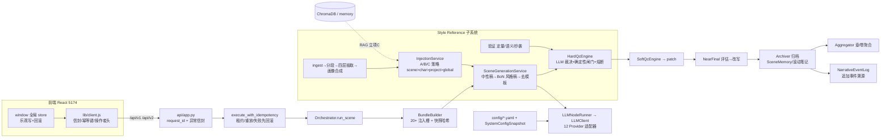

# 系统审查报告

> 审查日期：2026-07-02 ｜ 审查对象：雪花法驱动小说系统（main @ 38a859f）
> 审查方式：只读代码审查 + 无副作用验证脚本（离线模式最小集成复现）+ 测试基线运行
> 过程记录：`audit-progress.md`
>
> **修复执行状态（2026-07-02 同日追加）**：报告 §7 路线图第一/二/三批已全部执行完毕——
> P-1/2/3/4/5/6/7/8/10/11/12/14/15/16/17/18/19/20 已修复并配套回归测试（新增
> `test_catalog_cold_start_runtime_state.py`、`test_bundle_injection_efficacy.py`、
> `test_trash_purge_completeness.py` 共 12 个用例 + 迁移 `20260702_0060_hot_path_indexes`）。
> 两项有意保留：P-9 的 `PRAGMA foreign_keys` 按本报告自身警示（需先做存量孤儿盘点）
> 留作后续项，级联完整性已由 P-2 承担；P-13 因与 per-test 环境隔离冲突且收益低维持现状。
> 逐项明细与验证记录见 `audit-progress.md` 的"修复执行记录"章节。

## 1. 执行摘要

**一句话结论**：这是一套架构意图清晰、防御性设计密度很高的系统（幂等契约、确定性 QC 闸门、快照哈希、schema 漂移守卫都属于同类项目中的上乘做法），但存在一批**被宽泛异常吞掉的"静默失效"功能**和**新旧链路（雪花物化 vs 目录冷启动）之间的运行时状态缺口**——前者让若干蓝图承诺的能力实际从未生效，后者会在最昂贵的一步（LLM 已生成完毕的归档段）崩掉整次运行。

**最重要的发现**（按严重程度排序，编号对应第 6 节汇总表）：

1. 【严重】P-1：目录冷启动章（catalog 建章不建 `ChapterState`）跑场景通过全部 QC 后，归档段对 None 解引用 → 500 且整跑回滚，已生成成稿丢失（已复现）。
2. 【高】P-2：`purge_project`"永久清除"漏删 SceneDraft/FinalScene/SceneMemory/LlmCall/AuthorDraftRevision 等十余张含正文全文的表——删除语义未兑现，正文残留+永久孤儿。
3. 【高】P-3：前端幂等键每次请求随机新生成，后端整套幂等/去重/在途 409 机制被整体绕过（双击=两次执行）。
4. 【高】P-4：`orchestrator._load_style_baseline` 查询不存在的 `binding.active` 列，AttributeError 被吞 → §9 风格漂移基线永远取不到绑定画像（静默失效）。
5. 【高】P-5：`bundle_builder._character_arc_weights_prompt` 的 `count().where()` 必然 AttributeError 被吞 → §11 角色弧线权重注入自诞生起从未生效（已用解释器复现）。
6. 【高】P-6：`_narrative_state_digest` 用 `chapter_id.rsplit("_",1)` 推导 project_id 而不优先用 `scene.project_id`——目录冷启动章推导结果错误 → §2"权威角色状态"注入静默缺失（读写两侧规则不对称）。
7. 【高】P-7：`_index_scene_to_vector_store` 写入一个函数返回即销毁的裸 `InMemoryVectorStore` 实例 → §3 Track3 场景索引是彻底 no-op（正确的 `get_vector_store()` 工厂被绕过）。
8. 【中】P-8：幂等租约硬编码 90s、执行期间不续心跳，`models.yaml` 的 `job_runtime.idempotency_claim_ttl_seconds`/`heartbeat_interval_seconds` 是无人消费的死配置 → 长于 90s 的场景 run 撞重试会并发二次执行。
9. 【中】P-9：SQLite 未开 `PRAGMA foreign_keys`，全库 FK 仅是文档；高频表（scene_drafts/final_scenes/llm_calls/qc_reports 等）普遍缺索引；llm_calls 全量存 prompt+正文且无清理策略。
10. 【中】P-10：`llm_enabled=true` 时 6 个活跃节点（含核心的 style_draft/style_patch）在文件配置下无路由且故意不回退 stylize 别名 → 首次启用 LLM 必经"系统配置 sync-missing"，否则风格化全线报错（有引导，属首跑陷阱）。

**总体建议方向**：本轮不需要架构级重构。优先级应放在：① 消灭"静默失效"类缺陷（P-4/5/6/7 全部是 `except Exception` 吞掉的注入功能，修复成本低、收益直接）；② 补齐目录冷启动链路与雪花链路的运行时状态对等（P-1）；③ 兑现删除语义（P-2）；④ 前后端幂等契约对齐（P-3/P-8）。同时建立一条纪律：**"永不阻断"的降级路径必须以 WARNING 级别落日志并进指标**，否则蓝图能力的存活状态不可观测——本轮发现的四个静默失效全都因此长期未被察觉。

## 2. 系统概览

### 技术栈

| 层 | 技术 |
|---|---|
| 后端 | Python 3.12 · FastAPI · SQLAlchemy 2（同步）· Alembic（60 个迁移，单头 20260618_0059）· SQLite（WAL）· ChromaDB 1.5.7（可选，`memory` 后端回退） |
| LLM 接入 | 自研多 Provider 适配器注册表（12 家：openai/anthropic/deepseek/zhipu/gemini/qwen/moonshot/minimax/doubao/xai/ollama/openai_compatible），httpx 同步调用 |
| 前端主线 | React 18 + Vite（`frontend-react/`，5174）：视图挂 `window` 全局 store（ws-works/ws-catalog/ws-review/lf7-bridge/wr-doc-store），vitest 单测 |
| 前端遗留 | Vue 3 + Pinia（`frontend/`，5173，默认不启动），Playwright E2E |
| 配置 | `config/*.yaml`（models/prompts/allowlists/hash_contract/style_reference/evals）+ DB 内 `SystemConfigSnapshot` 运行时覆盖 |
| CI | GitHub Actions 三 job（后端 pytest 非 Chroma、React vitest+build、Vue 遗留）；重型 lane（React 契约 E2E、WSL Chroma）本地 `verify_release.ps1` |

规模：后端 `src/` 208 个 py 约 7.2 万行（services/ 约 4.9 万行、31 个路由文件约 7000 行、models.py 2091 行），后端测试 153 个文件 1323 个用例；React 前端 64 个 js/jsx；Vue 前端 139 个文件。

### 架构简述

单体 FastAPI 应用，按领域分路由（31 个 router 全部挂载于 `api/app.py`），一路由一服务；所有 ORM 模型集中在 `db/models.py`。统一响应信封 `{ok,data,error,request_id}`，变更类请求走 `X-Idempotency-Key` + `execute_with_idempotency`（内部负责提交/回滚）。LLM 调用统一经 `LLMNodeRunner`（节点注册表 → 路由配置 → 适配器 → 全量审计落 `llm_calls`），`llm_enabled=false` 时逐节点回退到确定性离线客户端。

### 模块清单（按审查分组）

| 分组 | 主要文件（backend/src/novel_system/…） | 规模 | 职责 | 审查深度 |
|---|---|---|---|---|
| 入口/横切 | api/app.py, api/response.py, api/deps.py, settings.py, db/session.py | ~0.4k | 应用装配、信封、设置、会话 | 深审 |
| 数据层 | db/models.py, alembic/（60 迁移） | 2.1k | 全部 ORM 模型 | 深审（迁移抽查） |
| 场景编排管线 | services/orchestrator.py, bundle_builder.py, scene_execution.py, archiver.py, aggregator.py, resolver.py | 3.0k | run 全链、上下文捆绑、归档聚合 | 深审 |
| 生成服务 | scene_generation.py, prompt_builder.py, context_budget.py | 2.2k | 中性/风格/补丁/续写生成、BoN、去模板 | 深审 |
| QC/质量 | qc_engine.py, scene_quality.py, literary_quality.py, self_repetition.py, auto_critique.py, best_of_n_blind_eval.py, scene_criticality.py | 6.5k | 硬/软 QC、21 维文学质量、自评 | 深审(qc/文学权重)+抽查 |
| LLM 接入 | llm_client.py, llm_task_runner.py, llm_node_registry.py, llm_providers/(12) | 3.7k | 请求构建、重试退避、审计、适配器 | 深审(client/runner) |
| 雪花域 | snowflake_workspace.py, snowflake_steps.py, snowflake_planner.py, snowflake_workspace_llm.py, projects.py | 7.2k | 十步雪花、急救、物化、结构确认 | 深审(工作台/物化) |
| Style Reference | style_reference/（28 文件） | 7.7k | 参考书学习→注入→验证→删书 | 深审(injection/cleanup)+抽查 |
| 版本/幂等 | idempotency.py, versioning/(5), version_manager.py, hash_engine.py | 2.3k | 幂等契约、晋升、恢复、向量别名 | 深审(idempotency)+抽查 |
| 作者正文域 | author_drafts.py, writer_room.py, author_lifecycle.py, author_desk.py | 3.7k | 正文草稿/修订/提案、回收站生命周期 | 抽查(冲突契约确认) |
| 评审域 | writer_review.py, writer_deep_review.py, near_final.py, human_review_manager.py, review 路由 | 4.6k | 评估/深评/终稿门/人审事件 | 轻扫 |
| 目录/资料库/回收站 | catalog.py, library.py, trash.py, knowledge_catalog.py | 2.5k | FE 目录、实体关系、软删/永久清除 | 深审(catalog 建章/trash purge) |
| 长篇域 | longform_tower.py, longform_control.py, longform_editor.py | 2.2k | 控制塔锚点/契约/审计、诊断卡 | 轻扫 |
| 叙事一致性群 | narrative_event_log.py, prose_event_extractor.py, causal_chain_validator.py, foreshadow_lifecycle.py, tension_curve.py, character_*(4), voice_fingerprint.py, style_drift_detector.py, theme_anchor.py | ~5k | 事件溯源、因果/伏笔/张力/主题 | 轻扫(调用面深看) |
| 系统配置 | system_config.py, 路由 | 2.2k | 快照激活、密钥加密、节点路由管理 | 深审(鉴权/加密/审计) |
| 其他支撑 | interop_center.py, indexing, vector_store.py, chapter_runner.py, chapter_runtime.py, pagination.py 等 | ~3k | 导入导出、索引作业、向量抽象 | vector_store 深审，余轻扫 |
| React 前端 | lib/client.js, ws-works/ws-catalog/ws-review/lf7-bridge/wr-doc-store, ws-app 等 64 文件 | ~12k | 主线 UI + 全局 store | 深审(client/works/doc-store)+抽查 |
| Vue 前端（遗留） | router.js, lib/api/, views/, stores/ | ~20k | 遗留 UI | 轻扫（默认不启动） |
| 配置/脚本 | config/*.yaml, scripts/, .github/ | — | 路由/提示词/策略/CI | 一致性校验+轻扫 |

## 3. 宏观架构评估

**【优点】分层与一致性**。路由→服务→模型三层边界清晰，31 个路由几乎无业务逻辑（校验+委托+信封）；"一路由一服务"的映射在整个代码库高度一致。同类问题解法统一：所有变更走同一个幂等包装、所有错误走同一个 `DomainError`→信封、所有 LLM 调用走同一个 runner+审计。对一个 7 万行的单人项目而言，这种一致性是最重要的可维护性资产。

**【优点】防御性契约设计**。`BundleSnapshotHashProjection` 把提示词上下文冻结成可哈希快照并全程携带（bundle_hash 贯穿 draft/final/qc 的血缘）；QC 是"LLM 裁决 + 确定性闸门叠加 + 重复问题熔断"的三层结构（qc_engine.py:731-789），LLM 的误报可被规则反驳、漏报可被规则补充；`test_metadata_isolation.py` 的双路建 schema 漂移守卫精准堵住了"测试全绿但运行时 500"的经典坑。这些是明显高于平均水准的工程判断。

**【问题】"永不阻断"降级被实现为"静默失效"**。全后端 78 处 `except Exception`，其中约 20 处直接 `pass`/`return None`，且日志级别多为 DEBUG（如 `orchestrator.py:209,633,671,767,845`、`bundle_builder.py` 内 12 个注入槽的兜底）。设计意图（辅助注入不阻断主流程）是对的，但后果是：本报告发现的 P-4/P-5/P-6/P-7 四个功能级缺陷全部藏在这些兜底后面，**没有任何运行时信号表明 §2/§3/§9/§11 蓝图能力从未生效**。修复建议：降级路径统一 `logger.warning`（带 scene_id/槽名），并给 bundle 快照加一个 `degraded_slots` 字段随 `orchestration-signals` 暴露——一次改动即可让所有此类缺陷可观测。

**【问题】双链路（雪花物化 vs 目录冷启动）运行时状态不对等**。系统最初假设 ChapterGoal/SceneCard 只经 `approve_outline_plan`（projects.py:235 同时建 ChapterState）或 `POST /api/v1/chapters`（routes/chapters.py:119 同上）诞生；FE 主线新增的 catalog 建章链路（catalog.py:203-231）只建 ChapterGoal 不建 ChapterState。下游 orchestrator 补了 SceneRunState 的同族缺口（orchestrator.py:55-59 有注释），但 archiver/aggregator 仍无守卫（P-1）。**结构性建议**：把"某 chapter/scene 的运行时状态行"收敛为唯一的 `ensure_*` 入口（chapter_runtime.py:232 已有现成实现），所有消费方（archiver/aggregator/orchestrator）改为经它获取，而不是各自 `session.get` 后祈祷行存在。

**【问题】关键路径上的 id 字符串启发式**。`chapter_id.rsplit("_", 1)[0]` 推导 project_id 出现在 orchestrator.py:559,758、bundle_builder.py:600,784,872,919,943——它只对 `{project}_CH01` 格式成立，对 catalog 的 `{project}_CH_{hex8}`（catalog.py:212）得到错值。SceneCard.project_id 列早已存在且物化/目录两条链路都会填，启发式只该是 legacy 行的兜底。这类"用 id 格式当外键"的隐式契约没有任何测试锁定，是跨模块脆弱点（P-6）。

**【问题】依赖方向总体健康，但 services 内部呈网状**。routes→services→db 无反向依赖、无循环 import（服务间大量函数内延迟 import，客观上抑制了环）；但 orchestrator/bundle_builder 对 narrative 群、style_reference、theme/tension 等十余个服务的扇出全部内联在方法体里，注入槽的增加史（20+ 个 `inline_digests` 槽）已让 `BundleBuilder.build` 长到 460 行。可扩展性现状：加一个新注入槽是"顺手加一段"，但每段都要手工维护 source_version_refs/ordered_injections/inline_digests 三处一致——建议提炼"注入槽 provider"小接口（name → (refs, digest) | None），把 20 段模板代码收敛成注册列表。

**【优点/问题并存】技术选型**。SQLite+WAL+busy_timeout 对单作者本地应用是正确选型；但配套纪律没跟上：未开 `PRAGMA foreign_keys`（session.py:26-34 只设了 WAL/busy_timeout，模型注释 models.py:2083-2084 也承认 FK 不强制），删除完整性完全依赖手工级联——style_reference 做到了（cleanup.py），trash.purge_project 没做到（P-2）。同一约束、两种执行水平，说明缺少"删除必须过孤儿清单"的机制化检查。

**【问题】审计即膨胀**。`llm_calls.request_payload_summary` 存完整 messages+源稿全文、`response_payload_summary` 存完整 struct构化输出（llm_task_runner.py:361-394,425-466）；OperationLog 每个幂等请求 2-3 行含完整请求载荷；`author_draft_revisions` 每次保存一份全文快照。全部无索引、无保留策略。单本 50 章×每场 3-9 个候选的量级下，这个 SQLite 文件会以 GB 级增长且查询线性退化（P-9/P-15）。

**【优点】配置分层**。文件 YAML（缺省）→ DB 快照（激活覆盖）→ 环境变量的三层设计合理，密钥单独走 Fernet 加密的 SystemSecret 且导出接口只回 YAML 不带密钥。缺口是配置键的"消费方核查"：`job_runtime.idempotency_claim_ttl_seconds`/`heartbeat_interval_seconds`/`max_reclaim_attempts.idempotency` 均无人读取（P-8），配置文件在对使用者说谎。

## 4. 模块级详细评估

> 表格中"位置"均相对 `backend/src/novel_system/`（前端另注明）。轻扫模块的结论基于结构+关键函数抽查，见第 9 节覆盖说明。

### 4.1 入口/横切（api/app.py, api/response.py, settings.py, db/session.py）
- **职责**：应用装配、CORS、request_id/operator_ref 中间件、三级异常信封、设置解析、引擎/会话单例。
- **现状评估**：良好。异常分层（DomainError→结构化 / OperationalError→busy 识别 / 兜底→受 `expose_error_detail` 控制的 500）干净利落；CORS 在 `*` 时禁 credentials 是正确细节。
- **问题**：

| 严重 | 位置 | 问题 | 原因 | 建议 |
|---|---|---|---|---|
| 中 | db/session.py:26-34 | 未执行 `PRAGMA foreign_keys=ON` | FK 全库不强制，删除完整性靠手工 | 在 `_install_sqlite_pragmas` 增加一行；先跑一次全库孤儿盘点再开启，避免存量孤儿导致后续删除报错 |
| 低 | settings.py:105 | `get_settings()` 每次调用都 `vector_store_dir.mkdir` | getter 带文件系统副作用；`include_runtime_config=True` 时还每次查 DB（system_config.py:108-141），单个请求内被多处重复调用 | mkdir 移到 engine/store 初始化处；运行时配置读取加短 TTL 缓存 |
| 低 | api/app.py:74-80 | 中间件只发 request_id，不记访问日志 | 排障时只能靠 llm_calls/OperationLog 间接还原 | 加一行结构化访问日志（方法/路径/状态/耗时） |

- **优化建议**：`unhandled_error_handler` 里把 `exc` 类型名放进 details（不泄内容），方便前端按类聚合上报。

### 4.2 数据层（db/models.py + alembic/）
- **职责**：74 个 ORM 模型；60 个迁移（单头，`alembic heads`=20260618_0059）。
- **现状评估**：待改进。模型定义本身规范（CheckConstraint 用得多、注释交代设计意图、`utcnow()` 单调时钟处理了 Windows 粒度问题），但索引与外键纪律不足。
- **问题**：

| 严重 | 位置 | 问题 | 原因 | 建议 |
|---|---|---|---|---|
| 中 | models.py:725-737(SceneDraft), 1144-1155(FinalScene), 740-755(QcReport), 697-722(LlmCall), 1234-1244(AttemptTracker), 593-602(SceneBundle), 1342-1358(HumanReviewEvent), 1268-1328(ReviewItem 的 scene_id/chapter_id/state) | 高频查询列无索引（SQLite 不给 FK 自动建索引，且这些列多数连 FK 都不是） | 按 scene_id/chapter_id 的查询遍布 orchestrator/qc/routes，数据量随长篇线性增长后全表扫描 | 一个迁移补齐：`(scene_id)`、`(chapter_id)`、llm_calls `(scene_id, created_at)`、review_items `(project_id, state)`；同时写进 `__table_args__` 保持 drift guard 通过 |
| 中 | models.py 全库 | 时间戳全部 String（ISO） | 设计决策（可排序、SQLite 友好），但比较/窗口查询全靠字符串序，且 `utcnow()` 的单调保证只在单进程内成立 | 保持现状可接受；文档化"禁止多 worker 部署"的前提（uvicorn 默认单 worker，start-dev 亦然） |
| 低 | models.py:432,461 | ChapterGoal/SceneCard 的 project_id 可空 + chapter_id/scene_id 是全局主键 | 依赖 id 前缀约定防跨项目碰撞（三条造 id 链路都带 project 前缀，interop 导入未见直造章卡） | 新写入路径强制 project_id 非空；长期考虑补 NOT NULL 迁移 |

- **优化建议**：`ReviewItem.target_collection` 的 Computed CASE 每加一种 item_type 都要迁移，可在注释里给出"新增类型三步清单"（模型 CASE、迁移、materializer）。

### 4.3 场景编排管线（orchestrator.py, bundle_builder.py, scene_execution.py, archiver.py, aggregator.py）
- **职责**：run 全链（契约检查→蓝图→bundle→生成→BoN→自评→软硬 QC→near-final→归档→章/卷聚合→事件溯源→漂移检测）。
- **现状评估**：有问题。主干控制流清晰、每步有 AttemptTracker 痕迹；但辅助注入层是本轮缺陷重灾区（四个静默失效 + 一个归档崩溃）。
- **问题**：

| 严重 | 位置 | 问题 | 原因 | 建议 |
|---|---|---|---|---|
| 严重 | archiver.py:32,68；aggregator.py:121-122 | `session.get(ChapterState, …)` 无 None 守卫即 `chapter_state.chapter_passed_scene_count += 1` | catalog.py:203-231 建章不建 ChapterState；QC 全通过后归档段 AttributeError→500→事务回滚，成稿丢失。已复现：`'NoneType' object has no attribute 'chapter_passed_scene_count'` | 归档/聚合改用 chapter_runtime.py:232 `_ensure_chapter_state`（提为公共函数）；catalog.create_chapter 同步补建状态行；补一条 catalog 冷启动→run→archive 的回归测试 |
| 高 | orchestrator.py:869-873 | 查询 `StyleReferenceInjectionBinding.active == 1`，模型只有 `status` 列（models.py:1983） | AttributeError 被 :883 `except Exception: return None` 吞掉 → 漂移基线永远 None，`detect_chapter_drift` 只能用内置默认基线 | 改为 `status == "active"`（同 literary_quality.py:117-124 的正确写法）；该函数补一个单测 |
| 高 | orchestrator.py:757-765 | `_index_scene_to_vector_store` new 裸 `InMemoryVectorStore()`（纯实例 dict），写完即随函数销毁 | §3 Track3"归档场景入向量库"完全 no-op；正确工厂 `get_vector_store()`（vector_store.py:229-245，memory 后端有进程级单例、chroma 有持久化）被绕过 | 改用 `get_vector_store()`；或者直接删掉此函数——bundle_builder._similar_scene_context 本来就每次从 DB 重建，不依赖这份索引 |
| 高 | orchestrator.py:558-559 vs bundle_builder.py:600 | 事件写侧 `scene.project_id or … or rsplit` / 读侧只用 rsplit | 见 P-6（详见 4.4） | 读侧与写侧统一为 `scene.project_id or 启发式` |
| 中 | orchestrator.py:184-209 | auto-critique 的 try 块把 `generate_style_patch`（真实的补丁生成）也包进 `except Exception: debug` | 补丁生成的真实失败被降级为 debug 日志，返回未修订稿且无痕迹 | 只把 critique 本身放进兜底；patch 失败至少 WARNING + AttemptTracker |
| 低 | orchestrator.py:53 | `session.get(SceneCard, scene_id)` 无 None 检查（:94 直接 `.chapter_id`） | 路由层 `require_active_scene` 已挡住，但服务被其他调用方复用时是 500 而非 404 | 函数开头补 `if scene is None: raise DomainError(404)` |
| 低 | orchestrator.py:632-633 | `_record_narrative_events` 整体 `except Exception: debug` | §2 称事件日志为"single source of truth"，但记录失败无任何可见信号（见待确认 Q-1） | 至少 WARNING + 计数指标 |

- **优化建议**：run_scene 的四个早退分支重复拼装同一个十键返回字典（:126-141,238-255,284-302,310-333），提炼 `_run_result(**overrides)` 可减 80 行且防止未来加字段漏分支。

### 4.4 BundleBuilder 注入层（bundle_builder.py）
- **职责**：20+ 注入槽拼装 + 快照哈希。
- **现状评估**：有问题（主干良好，辅助槽三处失效/错误）。
- **问题**：

| 严重 | 位置 | 问题 | 原因 | 建议 |
|---|---|---|---|---|
| 高 | bundle_builder.py:884-886 | `sa_func.count(SceneCard.scene_id).where(...)`——`Function` 对象没有 `.where` 方法 | 必然 AttributeError，被 :896 兜底吞掉 → §11 弧线权重注入恒 no-op（解释器复现：`Neither 'count' object nor 'Comparator' object has an attribute 'where'`） | 改 `session.scalar(select(func.count()).select_from(SceneCard).where(...))` |
| 高 | bundle_builder.py:880-882 | `execute(sa_func.count(ChapterGoal.chapter_id))` 无任何 WHERE | 语法上恰好可执行，但统计的是**全库所有项目**的章数 → 修好 :884 后进度分母仍是错的（多项目时故事进度被稀释） | 补 `ChapterGoal.project_id == project_id, trashed_flag == 0` |
| 高 | bundle_builder.py:600 | `_narrative_state_digest` 只用 rsplit 启发式推导 project_id | 目录冷启动章 id 为 `{project}_CH_{hex}`（catalog.py:212）→ 推导为 `{project}_CH` → 查询到空事件集 → 权威角色状态注入静默缺失；同文件 :943（information_asymmetry）与 :919（relationship_matrix）都是 `scene.project_id or 启发式`，唯独此处遗漏 | 统一为 `scene.project_id or 启发式` |
| 低 | bundle_builder.py:780-823 | `_similar_scene_context` 每次 run 从 DB 全量重建集合再查一次；相似度是字符集合交集（vector_store.py:12-15），并非语义 | O(n) 重建可接受（n=已归档场景数），但"§3 Track3 semantic retrieval"的命名高估了实现 | 短期：文档如实降级描述；长期：接 `get_vector_store()`+真实 embedding |
| 低 | bundle_builder.py:57-59 | `scene`/`chapter`/`state` 三个 get 均无 None 守卫 | 仅被 orchestrator 在守卫后调用，暂无害 | 同 4.3 建议补 404 |

- **优化建议**：见第 3 节"注入槽 provider"收敛方案。

### 4.5 生成服务（scene_generation.py, prompt_builder.py, context_budget.py）
- **现状评估**：良好。失败路径全部落 LlmCall+AttemptTracker；BoN 低离散度三级补救（升温→提示词变异→风格强调轮换）忠实实现 §6.3；de-template row_id 撞主键的坑已由近期提交修复且留了注释。
- **问题**：

| 严重 | 位置 | 问题 | 原因 | 建议 |
|---|---|---|---|---|
| 低 | scene_generation.py:1297-1302 | `_extract_scene_text` 异常消息硬编码 "neutral_draft response missing scene_text" | 风格/补丁/续写路径共用此函数，报错误导排障方向 | 消息去掉 "neutral_draft" 或传入 stage |
| 低 | scene_generation.py:342-350 | BoN 温度扩散 ±0.05 极窄，首轮候选几乎必然低离散→常态性触发二轮重试（多花 3 次调用） | spread 常量与 0.15 阈值不匹配 | 首轮 spread 提到 0.1-0.15 或从配置读 |
| 低 | scene_generation.py:354 | 候选 row_id = `versioned_id + f"_{idx}"`，重跑同 bundle 会与上次候选撞主键——实际因 bundle_id 每次自增（bundle_builder._next_bundle_id）而避开 | 唯一性隐式依赖上游 bundle_id 自增 | 注释说明该依赖，或并入 de-template 的哈希后缀方案 |

- **优化建议**：`generate_style_draft_candidates` 187 行、三层嵌套，把"低离散补救"两个块提炼成私有方法可读性大增。

### 4.6 QC/质量（qc_engine.py, literary_quality.py, self_repetition.py, auto_critique.py 等）
- **现状评估**：良好。HardQc 的"确定性反驳 LLM 误报"（`_issue_contradicts_deterministic_scene_card`）与"确定性补充 LLM 漏报"（`_apply_deterministic_quality_gates`）是全库最好的设计之一；21 维权重经解释器验证齐全且和为 1.0；`get_dimension_weights` 的 binding 查询写法正确（对照出 4.3 的 P-4 是孤例）。
- **问题**：

| 严重 | 位置 | 问题 | 原因 | 建议 |
|---|---|---|---|---|
| 低 | qc_engine.py:1060-1061 | style validation gate `except Exception: return None`（noqa BLE001） | 设计意图明确（gate 不阻断），但验证子系统真实故障不可见 | WARNING + metric（MetricsRecorder 已有 outcome="error" 记录，仅当 profile 已解析时——解析前的失败仍不可见） |
| 低 | qc_engine.py:633-641 | `evaluate` 里 `scene`/`state` get 无 None 守卫 | 同 4.3 家族 | 同前 |

### 4.7 LLM 接入层（llm_client.py, llm_task_runner.py, llm_node_registry.py, llm_providers/）
- **现状评估**：良好。重试矩阵（超时/429 尊重 Retry-After/5xx/畸形 JSON）+ 指数退避带抖动 + 大括号配平的 JSON 抢救（`_iter_json_object_candidates`）都很扎实；错误信息带 provider 协议提示（protocol_hint）对排障友好。
- **问题**：

| 严重 | 位置 | 问题 | 原因 | 建议 |
|---|---|---|---|---|
| 中 | llm_task_runner.py:371-394 | request_summary 携带完整 messages + source_draft_content 全文落库；response 侧 :241-248 存完整 structured_output | 每次 LLM 调用把 prompt+正文双份写入 llm_calls（见 P-15 膨胀） | summary 截断到定长（如 4KB）+ 存 prompt_hash（已有字段）；或加保留策略 |
| 中 | llm_client.py:364-375 + llm_node_registry | `llm_enabled=true` 时 `task_config()` 对 6 个活跃节点（style_draft/style_patch/project_outline_plan/writer_deep_review/style_profile_extract/literary_eval_live）抛 KeyError→LLM_ROUTE_NOT_CONFIGURED；stylize 别名只在离线模式回退（llm_task_runner.py:311-314） | 首次启用 LLM 未跑 sync-missing 前，核心风格化节点全部失败（错误带引导，属可恢复首跑陷阱） | models.yaml 直接补齐这 6 个节点的缺省路由；或 enabled 模式也允许 stylize 别名回退并 WARNING |
| 低 | llm_client.py:147-151 | 每次 generate 新建 httpx.Client（无连接池复用）；重试 `time.sleep` 阻塞线程池 worker | 单机单作者可接受 | 复用 client；必要时换 httpx 连接池 |

### 4.8 雪花域（snowflake_workspace.py, snowflake_steps.py, snowflake_planner.py, projects.py）
- **现状评估**：良好（近期五轮 QA 密集修复后）。物化闸门（rewrite 场景阻断、空场景计划 blocker）、staleness 的 row_uid 锚点、resync 的 dry-run+diff+OperationLog 都在位；`approve_outline_plan`（projects.py:235）正确同建 ChapterState。
- **问题**：

| 严重 | 位置 | 问题 | 原因 | 建议 |
|---|---|---|---|---|
| 低 | snowflake_workspace.py:670-708 | materialize 里 `workspace()` 在一次请求内被调用 2-3 次（:672 入口 + :708 返回 + approve 链路又一次），每次全量重算 latest_by_step/scene_board/gate | 单请求内重复重计算，项目大时放大延迟 | workspace 计算结果在方法内复用 |
| 低 | projects.py:584 | LLM 场景 id `str(raw_scene.get("scene_id") or …)` 直接信任 LLM 返回的 scene_id 字符串 | LLM 可返回与其他章撞号的 id（后续建卡时同 id 覆盖/冲突） | 强制 `{chapter_id}_SC{seq}` 格式化，忽略 LLM 提供的 id |

### 4.9 Style Reference 子系统（services/style_reference/）
- **现状评估**：良好——全库质量最高的子系统。注入策略（scene>character>project>global 的 rank 单点 `_binding_rank`）、多层叠加的预算加权、红线段永不截断、删书级联连 RAG 索引和物化提升行都清掉（cleanup.py:41-171，与 P-2 的 trash 形成鲜明对比）、反馈调档基于冻结 base_confidence 可重算——文档与实现互相咬合。
- **问题**：

| 严重 | 位置 | 问题 | 原因 | 建议 |
|---|---|---|---|---|
| 低 | style_reference/cleanup.py:190-199 | metric 保留清理的 cutoff 用 `…Z` 后缀格式，与 `utcnow()` 落库的 `+00:00` 后缀不同 | 仅同秒边界行为差 1 秒内偏斜，无实质影响 | 统一用 isoformat 生成 cutoff |
| 低 | injection.py:41-46 | `system_prompt_max_tokens: 800` 实际按**字符**截断（`_truncate_lines(text, max_chars)`） | 名为 tokens 实为 chars，中文下预算被低估约 1 倍 | 改名 max_chars 或换真实 token 计数 |

- **优化建议**：作为其他模块的参考样例（删除级联清单、配置化策略、错误可观测的 MetricsRecorder 模式）。

### 4.10 版本/幂等（idempotency.py, versioning/, hash_engine.py）
- **现状评估**：待改进（设计好、参数错）。"失败先回滚再单独落失败标记"（idempotency.py:201-248）修掉了半提交的老 bug；release_review 拒绝复活 superseded 版本（versioning/promotion.py:42-46）是近期红线修复。
- **问题**：

| 严重 | 位置 | 问题 | 原因 | 建议 |
|---|---|---|---|---|
| 中 | idempotency.py:44 + settings.py:14 + config/models.yaml:363-371 | 租约 TTL 硬编码 90s（无 env 无配置消费）；action 执行期间无心跳续租；models.yaml 的 idempotency_claim_ttl_seconds/heartbeat_interval_seconds/max_reclaim_attempts.idempotency 无人读取 | LLM 场景 run（BoN 最多 9 次生成+多次 QC）轻易超 90s：客户端超时重试→旧租约视为过期→attempt_no+1 **并发二次执行**，两跑竞争同 scene 行/撞 row_id；同时配置文件承诺的旋钮是死键 | runner 每次 LLM 调用后续租（heartbeat_at/lease_expires_at）；TTL 从 job_runtime 读取；文档写明与前端的重试契约 |

### 4.11 作者正文域（author_drafts.py, writer_room.py, author_lifecycle.py）
- **现状评估**：良好（抽查）。乐观并发（base_revision_no→AUTHOR_DRAFT_CONFLICT）契约存在且被前端消费；修订快照 F2 机制完整。
- **问题**：AuthorDraftRevision 的无限全文快照增长（无压缩/保留策略）与 P-2 的 purge 漏删叠加（低，并入 P-15 治理）。

### 4.12 目录/资料库/回收站（catalog.py, library.py, trash.py, knowledge_catalog.py）
- **现状评估**：有问题（trash purge）。catalog 的建章/场景/排序逻辑本身清晰（display_order、is_chapter_last 维护正确）。
- **问题**：

| 严重 | 位置 | 问题 | 原因 | 建议 |
|---|---|---|---|---|
| 高 | trash.py:166-232 | purge_project 只删 FE 域+雪花域 15 张表；**漏删** SceneDraft/FinalScene/SceneMemory/ChapterMemory/ChapterRollingNote/SceneBundle/SceneBlueprint/SceneQualityContract/SceneExecutionContract/GenerationPlanningArtifact/QcReport/WriterEvaluation/RevisionCandidate/AutoRewriteRun/PassagePatchCandidate/AuthorStructureCandidate/**AuthorDraftRevision**（:201-203 只删了 Event+Draft）/AttemptTracker/LlmCall/HumanReviewEvent/StagedBackfill，以及**自带 project_id 列却不在删除列表**的 NarrativeEvent/ForeshadowTracker/VolumeSummary/ReviewItem/ProjectBacktrackItem | "永久清除"后正文全文仍以草稿/成稿/记忆/修订快照/LLM 载荷等形式留库（隐私+预期违背），孤儿永远无法经 UI 清理 | 参照 cleanup.py 的做法补全清单（scene_ids/chapter_ids 维度删无 project_id 的表）；补一条"purge 后全库无残留"的表级断言测试 |
| 中 | catalog.py:203-231 | create_chapter 不建 ChapterState | P-1 的根因之一 | 与 4.3 修复配套 |

### 4.13 评审域 / 长篇域 / 叙事一致性群（轻扫）
- **现状评估**：结构良好（轻扫未发现新问题）。评审域的 human_review 事件模型（allowed_actions/result_status_map）设计规整；叙事群全部以 advisory 模式挂在管线上（P-4/P-5/P-6 的消费端），其自身逻辑未深审——注意它们的产出因上游注入失效而部分不可达。
- **建议**：修复 4.3/4.4 后对 tension/theme/arc 三个注入的产出做一次人工 spot-check（此前从未真实进过提示词的功能，首次生效可能暴露提示词长度/格式问题）。

### 4.14 系统配置（system_config.py + 路由）
- **现状评估**：良好。写操作全部 require_admin_token；密钥 Fernet 加密存库、导出不含密钥、展示走 `_mask_secret`；provider 探测/模型列表有降级路径。
- **问题**：

| 严重 | 位置 | 问题 | 原因 | 建议 |
|---|---|---|---|---|
| 低 | system_config.py:1225-1241 | admin token 用 `==` 比较（非常数时间）；无 token 时回退 loopback 判定 `request.client.host`——反向代理后所有请求都是 loopback | 本地单机默认场景可接受；一旦有人把它挂到代理后就是全开 | `hmac.compare_digest`；文档标注"不得置于反代后暴露" |
| 中 | system_config.py:570-577 | llm_call_audit 一次加载 ≤5000 行 LlmCall（含全量 JSON 载荷）只为聚合计数 | 与 P-15 叠加后此接口会显著变慢 | 查询只取聚合需要的列（`select(LlmCall.node_id, LlmCall.error_code, …)`） |

### 4.15 React 前端主线（frontend-react/src/）
- **现状评估**：良好（store 层）/待改进（幂等契约）。乐观写+失败回滚+refetch 的契约在 ws-works/ws-catalog/wr-doc-store 一致落实；client.js 的错误归一化（NETWORK_ERROR 带当前 API base 提示）体验周到。
- **问题**：

| 严重 | 位置 | 问题 | 原因 | 建议 |
|---|---|---|---|---|
| 高 | frontend-react/src/lib/client.js:80-82（Vue 同款 frontend/src/lib/api/client.js:89-91） | `buildIdempotencyKey = path+Date.now()+random`，每次调用新键 | 后端幂等三件套（重放/去重/在途 409）被整体绕过：双击"运行本章"=两个键=两次并发 run；网络超时后的用户重试同理。键只是为了过后端的 400 必填检查 | 键改为"操作意图"级：同一按钮的一次用户意图内复用同一键（如 store 层为每个 pending 操作持键，直到成功/失败终态才丢弃）；配合 4.10 的租约续期 |
| 中 | frontend-react/src/wr-doc-store.jsx:122-128 | AUTHOR_DRAFT_CONFLICT 时直接丢弃本地未保存内容、以服务端为准重水合（alert 告知） | 冲突分支本地较新的编辑丢失且无副本 | 覆盖前把本地稿写入 `wr-doc:<sid>:conflict-<ts>` 缓存键，alert 里告知可找回 |
| 低 | frontend-react/src/ws-works.jsx:165-197 | wsMigrateLegacy 单部失败仅 console.warn，:192 无条件标记已迁移 → 失败作品永不重试 | 一次性迁移的静默数据遗留 | 全部成功才落标记，或把失败清单存回 localStorage 提示用户 |
| 低 | frontend-react/src/ws-works.jsx:304-307 | remove() 在仅剩一部作品时静默 return | 用户无从得知为何删不掉 | toast 提示"至少保留一部" |

### 4.16 Vue 遗留前端（frontend/）— 仅轻量扫描
- **理由**：已官宣 legacy、默认不启动、CI 仍保门禁。router.js 的 workflowGroups/writerPrimary 结构与文档一致；client.js 与 React 版同源（同样携带 P-3 的幂等键问题——修复时两端同改）。未逐视图审查。

### 4.17 配置与脚本（config/, scripts/, .github/）
- **现状评估**：良好。models.yaml 的 §7 反平庸采样惩罚只挂在 stylize（正确：QC/抽取类节点不该带惩罚）；CI 三 job 与本地 verify 脚本分层合理。
- **问题**：job_runtime 死键（并入 P-8）；`literary_eval` 路由直写 `NOVEL_SYSTEM_LITERARY_EVAL_REPORT_PATH` 文件路径来自 env（非用户输入，无穿越风险，核对过 routes/literary_eval.py:39-50）。

## 5. 系统流程评估

### 5.1 雪花十步 → 场景急救 → 结构物化 → 结构确认
**涉及**：snowflake_workspace → snowflake_steps/planner → projects.approve_outline_plan → ChapterGoal/SceneCard/ChapterState。
**结论**：健康。硬闸门（5 个硬步骤+rewrite 场景阻断+空场景计划 blocker）齐备；物化创建 ChapterState（projects.py:235），本流程内运行时状态完整；staleness 用 row_uid+consumed_input_sigs 做依赖感知，避免"上游一动全下游变灰"。近期五轮 QA 提交集中在此流程，修复痕迹与测试（ws-catalog adoptOutline 契约测试）相互印证。
**风险点**：approve→re-approve 的 chapter_states UNIQUE 冲突刚修过（b500aa6），说明该流程的幂等边界仍在磨合期——建议保留该回归测试的覆盖广度。

### 5.2 场景 run 全链（bundle → 生成 → BoN → 自评 → QC → near-final → 归档 → 聚合 → 事件/漂移）
**涉及**：orchestrator + bundle_builder + scene_generation + qc_engine + near_final + archiver + aggregator + narrative_event_log + style_drift_detector。
**结论**：主干可靠、外围失血。主干每步有痕迹（AttemptTracker/LlmCall/QcReport 血缘齐全）、失败分支都能停在可解释状态；但四个辅助注入/记录点静默失效（P-4/5/6/7），目录冷启动章在终点崩溃（P-1）。**模块间错误传播存在"断层"的具体形态是**：A（注入槽）失败时 B（生成）不知道也不该知道——这是设计；但**运维也不知道**——这是缺陷。
**跨模块公共关注点**：幂等（P-3/P-8 的前后端契约错位）恰好在这条最长、最贵的流程上风险最大——90s 租约 vs 多分钟的 run 时长。

### 5.3 参考书学习 → 画像 → 绑定 → 注入 → 验证 → 删书
**涉及**：style_reference 全链 + qc_engine 的 style gate + scene_generation 的注入点。
**结论**：健康，是其他流程的参照系。单点绑定解析（scene>character>project>global）被注入与验证两个消费方复用（qc_engine.py:1037-1041 与 injection.py:181-208 同源），避免了"注入用 A 画像、验证用 B 画像"的分叉；删书级联完整（含 RAG 索引与物化提升行）。**曾经的断层**（apply 不激活 profile → 注入恒 no-op）已由 6bc36fb 修复——这个历史 bug 与本轮 P-4/P-5 同型（静默 no-op），佐证了第 3 节"降级可观测性"建议的普适价值。

### 5.4 删除链路：软删（trash）→ 永久清除（purge）
**涉及**：ws-works.remove → DELETE /api/v2/projects（软删）→ trash 视图 → purge_entry/purge_project。
**结论**:有问题。软删阶段只动 trashed_flag（可逆，正确）；永久清除阶段漏删约 20 张表（P-2，见 4.12 表格），"删不干净"从单条流程看是数据残留，从产品语义看是对"永久清除"承诺的违背。风格参考子系统在同一问题上做对了，说明这是清单缺失而非能力缺失。

### 5.5 配置激活 → 运行时生效（YAML → DB 快照 → get_settings → LLM 路由）
**涉及**：system_config（draft/activate/secrets）→ settings.apply_active_api_config → llm_task_runner.task_config → llm_client。
**结论**：基本健康，两处摩擦。① P-10 首跑陷阱：文件配置对 6 个活跃节点无路由且 enabled 模式拒绝 stylize 别名回退——错误信息带引导（"Open System Config > LLM and sync missing"），但对"填了 API key 就想跑"的作者仍是一次必然的失败体验；② get_settings(include_runtime_config=True) 每次调用都查 DB+mkdir（P-13），在 run 这类多次调用 get_settings 的长流程里纯属浪费。

## 6. 问题汇总表

| 编号 | 模块 | 严重 | 类别 | 位置 | 问题描述 | 修复建议 | 工作量 |
|---|---|---|---|---|---|---|---|
| P-1 | 编排/归档 | 严重 | bug | archiver.py:32,68; aggregator.py:121; catalog.py:203 | 目录冷启动章无 ChapterState，归档段 None 解引用→500→整跑回滚（已复现） | ensure_chapter_state 收敛+建章补状态行+回归测试 | 0.5 天 |
| P-2 | 回收站 | 高 | bug/数据 | trash.py:166-232 | purge_project 漏删约 20 张含正文全文的运行时表（含有 project_id 列的 NarrativeEvent/ForeshadowTracker/VolumeSummary/ReviewItem） | 补全级联清单+无残留断言测试 | 1 天 |
| P-3 | 前端×2 | 高 | bug/契约 | frontend-react/src/lib/client.js:80-82; frontend/src/lib/api/client.js:89-91 | 幂等键每请求随机生成，后端去重/重放/在途 409 全被绕过 | 操作意图级键持有（pending 期间复用） | 1 天 |
| P-4 | 编排 | 高 | bug | orchestrator.py:872 | 查询不存在的 binding.active 列，被吞→漂移基线恒 None | 改 status=="active"+单测 | 0.5 小时 |
| P-5 | 注入层 | 高 | bug | bundle_builder.py:880-886 | count().where() 必然 AttributeError→§11 弧线权重注入恒失效；分母无 project 过滤 | select(func.count())+过滤+单测 | 1 小时 |
| P-6 | 注入层 | 高 | bug | bundle_builder.py:600 | 权威状态注入用 rsplit 推导 project_id，目录章推导错误→静默缺失 | scene.project_id 优先 | 0.5 小时 |
| P-7 | 编排 | 高 | bug | orchestrator.py:757-765 | 场景向量索引写入即销毁（裸 InMemoryVectorStore 实例） | 改 get_vector_store() 或删除 | 1 小时 |
| P-8 | 幂等 | 中 | bug/配置 | idempotency.py:44; settings.py:14; config/models.yaml:363-371 | 租约 90s 硬编码+无心跳；job_runtime 三个键无人消费 | 续租+读配置+文档 | 1 天 |
| P-9 | 数据层 | 中 | 性能/完整性 | db/session.py:26; models.py 多处 | 未开 foreign_keys；高频表缺索引 | pragma+索引迁移（同步 __table_args__） | 1 天 |
| P-10 | LLM 配置 | 中 | 可用性 | llm_task_runner.py:303-320; config/models.yaml | enabled 模式 6 节点无文件路由且拒绝别名回退→首跑必失败（有引导） | yaml 补路由或允许回退+WARNING | 0.5 天 |
| P-11 | 观测性 | 中 | 可维护性 | 全后端 78 处 except Exception（约 20 处直吞，DEBUG 级） | 静默降级不可观测——P-4/5/6/7 长期未被发现的根因 | 降级统一 WARNING+degraded_slots 信号 | 1-2 天 |
| P-12 | 前端 | 中 | bug/数据 | frontend-react/src/wr-doc-store.jsx:122-128 | 草稿冲突时本地未保存内容被覆盖丢弃 | 覆盖前留副本缓存键 | 0.5 天 |
| P-13 | 设置 | 低 | 性能 | settings.py:105,125-130 | get_settings 副作用 mkdir+每调用查 DB | 移副作用+短 TTL 缓存 | 0.5 天 |
| P-14 | 编排 | 低 | 健壮性 | orchestrator.py:53; bundle_builder.py:57; qc_engine.py:641 | 服务层 get 无 None 守卫（当前靠路由守卫） | 补 404 DomainError | 0.5 天 |
| P-15 | 审计存储 | 中 | 性能/隐私 | llm_task_runner.py:361-394; system_config.py:570; author_drafts 修订快照 | llm_calls 全量 prompt/正文落库、audit 全载荷聚合、修订快照无保留策略 | 截断+保留策略+聚合查询只取列 | 1-2 天 |
| P-16 | 系统配置 | 低 | 安全 | system_config.py:1225-1241 | token 非常数时间比较；loopback 判定在反代后失效 | compare_digest+部署警示 | 0.5 小时 |
| P-17 | 生成 | 低 | 可维护性 | scene_generation.py:1302,342-350 | 误导性错误消息；BoN 温度扩散与阈值不匹配 | 见 4.5 | 0.5 天 |
| P-18 | 雪花域 | 低 | 健壮性 | projects.py:584 | 信任 LLM 返回的 scene_id 字符串 | 强制格式化 | 0.5 小时 |
| P-19 | 前端 | 低 | UX/数据 | frontend-react/src/ws-works.jsx:192,304 | 迁移失败永不重试；删除限制无提示 | 见 4.15 | 0.5 天 |
| P-20 | 注入预算 | 低 | 正确性 | style_reference/injection.py:41-46 | max_tokens 实为按字符截断 | 改名或换 token 计数 | 0.5 小时 |

## 7. 行动路线图

**第一批（快速见效，合计约 2 天，全部是小改动大收益）**
1. P-4 → P-5 → P-6 → P-7：四个静默失效逐个修复（各 ≤1 小时），并为每个补最小单测——这是"蓝图能力实际生效"的一批解锁。
2. P-1：ensure_chapter_state 收敛 + catalog 建章补状态行 + 冷启动回归测试（0.5 天）。这是唯一会当场毁掉一次付费生成的缺陷，优先级最高。
3. P-16/P-18/P-20：三个半小时级小修顺手带走。

**第二批（契约对齐，约 3 天）**
4. P-3 + P-8 成对修（前端键持有 + 后端租约续期/配置消费）：幂等是跨栈契约，只修一端无效。
5. P-11：降级路径 WARNING 化 + `degraded_slots` 暴露到 orchestration-signals——防止第一批的同类缺陷再次沉默复发。

**第三批（数据治理，需规划的结构性调整，约 3-5 天）**
6. P-2：purge 级联补全 + "purge 后无残留"表级断言测试（建议以 style_reference/cleanup.py 为模板抽一个通用"派生数据清单"注册机制）。
7. P-9 + P-15：索引迁移、foreign_keys 开启（先孤儿盘点）、llm_calls 载荷截断与保留策略。
8. P-10：models.yaml 补 6 节点缺省路由（顺带核查 node registry 与 yaml 的一致性测试化，防再漂移）。

**随开发自然演进（不专门排期）**：4.3/4.5 的重复代码提炼、注入槽 provider 化、P-12/P-13/P-14/P-17/P-19。

## 8. 待确认问题

1. **事件日志的可靠性等级**（关联 P-11）：蓝图 §2 称 NarrativeEvent 是"single source of truth"，但 orchestrator._record_narrative_events 失败时仅 DEBUG 吞掉、无重试无补偿。推测：当前阶段事件日志实际是 best-effort 辅助层，"权威"是目标态而非现状。请确认预期等级——若确需权威，失败应至少产生 ReviewItem/人审事件。
2. **llm_calls 全量载荷是审计需求还是调试遗留**（关联 P-15）：全 prompt+正文落库对"运行证据"场景有价值，但与"参考书原文不外泄"的安全立场存在张力（注入了参考样例的 prompt 全文永久留库）。请确认保留策略与脱敏要求。
3. **"永久清除"的产品语义边界**（关联 P-2）：purge 是否应连 LlmCall/OperationLog 等审计记录一并清除？我的修复建议默认清除正文类、保留纯遥测（照搬 style_reference 对 MetricEvent 的取舍），请确认。
4. **前端幂等键的设计初衷**（关联 P-3）：每次新键可能是有意规避"重复点击返回缓存旧结果"的体验问题。若如此，正确解法是键级"意图会话"而不是随机键——请确认交互预期（双击运行按钮应当：a) 第二次被 409 拒绝，还是 b) 静默复用第一次结果？）。
5. **catalog 冷启动链路的完成度**：5f8400c 宣称"冷启动免雪花物化"，但该链路缺 ChapterState（P-1）、id 格式破坏多处启发式（P-6）。推测该链路只验证到了"建卡+触发 run 的 409 引导"，未验证"QC 全通过后的归档"。请确认冷启动是否为正式支持路径（决定 P-1 修复是补状态行还是干脆在 run 前置校验中阻断）。
6. **多 worker 部署是否在规划内**：utcnow() 单调性、模块级引擎单例、内存向量单例都隐含单进程假设。若未来要多 worker，这批假设需要整体重估（当前建议：在 README/CLAUDE.md 明示单 worker 约束）。

## 9. 审查覆盖说明

**深入审查**（逐行/逐函数）：入口横切层全部、db/models.py 全部、orchestrator、bundle_builder、scene_generation、qc_engine（HardQc 全读+SoftQc 结构）、llm_client、llm_task_runner、idempotency、snowflake_workspace（materialize/resync/结构面）、system_config（鉴权/加密/审计面）、style_reference 的 injection+cleanup、projects（物化面）、trash（purge）、archiver、aggregator、vector_store、routes/scenes.py（主要端点）、literary_quality（权重解析）、versioning/promotion（release 头部）；前端 client.js（React+Vue 对照）、ws-works、wr-doc-store 全读，ws-catalog 关键路径。

**轻量扫描**（结构+关键函数抽查，理由：业务外围/近期无变更/advisory 层）：writer_review、writer_deep_review、near_final、human_review_manager、knowledge_catalog、library、longform_tower/control/editor、叙事一致性服务群（causal/tension/foreshadow/character_*/theme/voice/drift——其调用面在深审模块中已覆盖）、author_drafts（冲突契约确认）、interop、indexing、chapter_runner/chapter_runtime、Vue 遗留前端（router/client 对照，默认不启动）、scripts/、migrations（60 个，验证单头；未逐个 diff）。

**验证性执行**（均无副作用，临时文件已清理）：
- P-5 用解释器复现 `count().where()` AttributeError；P-1 用文件库+离线模式复现归档段 `'NoneType' object has no attribute 'chapter_passed_scene_count'`；冷启动契约 blocked→409 引导路径确认符合设计。
- 配置一致性脚本：node registry 55 活跃节点 vs models.yaml 53 路由（差 6 见 P-10）；21 维质量权重和=1.0 无缺漏；alembic heads 单头。

**测试/lint 运行情况**：
- 后端 pytest（CI 同款 `-m "not chroma_integration"`，1306/1323 收集，17 个 Chroma 用例按标记排除）：**1302 通过 / 4 跳过 / 0 失败**，耗时 31 分 57 秒（本机为低配 CentOS 7 环境，CI 上应显著更快）。基线全绿。
- `chroma_integration` 用例未运行（本机 venv 无 chromadb，依 CLAUDE.md 该 lane 仅 WSL/Linux 严格环境执行）。
- 前端 vitest/build 未运行：本机 Node 16.20.2 低于工程要求（CI Node 22，Vite 7 系需 ≥20），强行运行结论不可信，故未执行。
- 仓库未配置 Python lint（无 ruff/flake8 配置），未运行。
- 全程未修改任何源代码文件；新增文件仅本报告与 `audit-progress.md`。

**附注：后端测试基线结果**：`1302 passed, 4 skipped, 17 deselected, 1 warning in 1917.94s`（退出码 0）。**值得强调**：这份全绿的 1306 用例基线与本报告的 P-1/P-4/P-5/P-6/P-7 并存——五个已复现的运行时缺陷没有任何一个被现有测试捕获，因为它们全部藏在 `except Exception` 降级路径或测试从不走的链路组合（目录冷启动×归档）里。这正是第 3 节"降级可观测性"与第 7 节第一批行动项各配一条回归测试的依据：测试很多，但辅助注入层的"生效断言"（而非"不抛错断言"）几乎为零。
